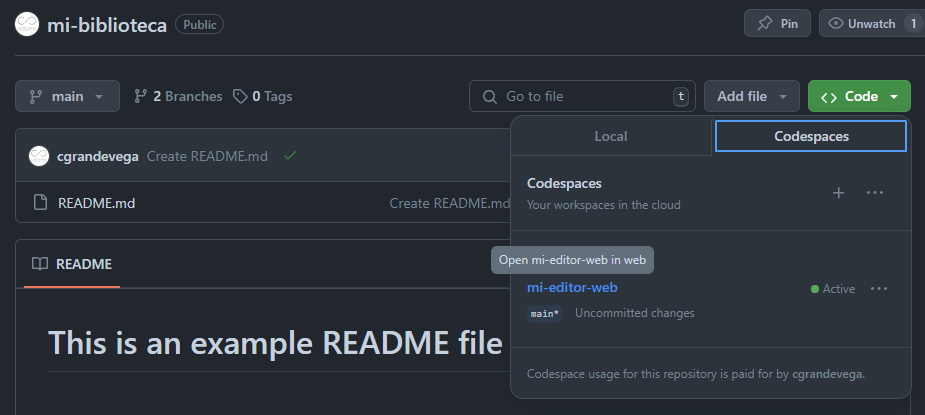
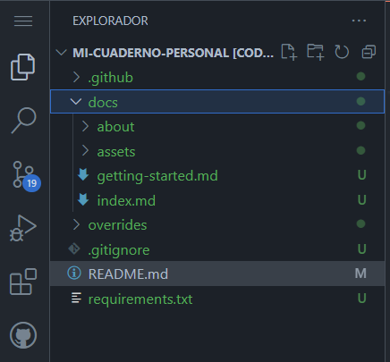
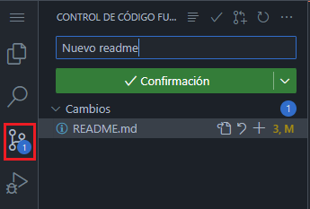
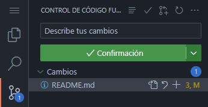

# Mi biblioteca

Mi biblioteca personal con notas de libros, artículos o disciplinas.

---

## Abrir la documentación

Para abrir la documentación es necesario seguir estos pasos:

1. Abre [tu repositorio](https://github.com/cgrandevega/mi-biblioteca) y selecciona el botón  `<> Code` y acontinuación selecciona `mi-editor-web` en la sección de `Codespaces`.

    

2. Para editar las páginas de su documentación accede a la carpeta `docs` en el explorador de archivos.

    


## Desplegar en local la documentación

Copia y pega este comando en la consola del editor de código:

```py
python -m mkdocs serve -w overrides
```

*Recuerda que para pegar este comando solo necesitas hacer **click con el botón derecho en la terminal*.


## Publicar la documentación

1. Dale al botón de `Control de código fuente`.

    

2. Escribe el mensaje de guardado para registrarlo en el histórico de cambios

    


3. Selecciona el botón de `confirmación`
