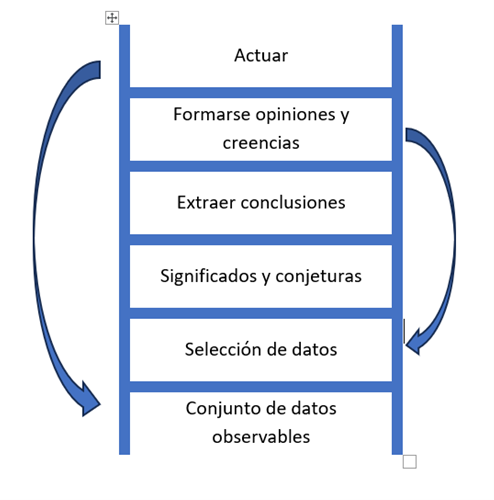

# Di lo que quieres decir
:fontawesome-solid-user-pen: Autor: Oren Jay Sofer

## Prólogo

En este libro el autor explora los muchos matices de nuestra manera de hablar y arroja luz sobre los patrones que fomentan el bienestar y la armonía y sobre aquellos que solo conducen a un aumento de la frustración y la angustia.

En la práctica de la comunicación **lo fundamental no es lo que decimos, sino de dónde venimos y cómo lo decimos.**

Uno de los fundamentos de este libro es que **la comunicación, como cualquier otro arte, requiere práctica.**

## Primer paso: guiar con la presencia

La comunicación eficaz depende de nuestra capacidad de estar presentes. Hablar abierta y sinceramente, escuchar con atención y manejarse en los giros y recovecos inevitables de una conversación **requiere un alto grado de autoconciencia.**

Para decir lo que queremos decir, primero hemos de saber lo que queremos decir. Para saber lo que queremos decir, hemos de escucharnos a nosotros mismos y discernir lo que para nosotros es válido.

El primer paso de la comunicación consciente es guiar con la presencia, es decir que nos mostremos y visibilicemos con la mayor plenitud que sea posible.

Vamos a explorar qué significa guiarse con la presencia.

## 1. El centro de nuestras vidas

“El lenguaje es muy poderoso. No solo describe la realidad. Crea la realidad que describe.” Desmond tutu 

Durante las primeras semanas de un bebé y meses, solo cuenta con dos herramientas para comunicar sus necesidades y deseos: el llanto y la sonrisa. 

La mayoría de las personas aprende una mezcla de estas estrategias para satisfacer sus necesidades. Por tanto, todos contamos con adiestramiento comunicativo, solo que por lo general es aprendizaje ha sido el inconsciente y no intencionado. 

Lo bueno de todo esto es que, puesto que el lenguaje es aprendido, y dado que nuestros patrones de comunicación y los hábitos emocionales que los impulsa son adquiridos, pueden desaprenderse y reorientarse. Podemos aprender a hablar y a escuchar de una manera nueva más acorde con el tipo de vida que queremos llevar y con la sociedad que queremos crear podemos aprender a decir lo que queremos decir y descubrir cómo escuchar atentamente.

### El universo de la comunicación

 Nuestro propósito a la hora de comunicarnos puede ser estratégico (conseguir cierto fin) con relación a (conectar), pero en muchos casos la comunicación implica un intercambio significativo que conduce a la comprensión. 

**La comunicación eficaz depende de nuestra capacidad para prestar atención.** La conciencia es el fundamento esencial de toda comunicación. La comunicación consciente tiene por objeto generar comprensión a través de la conciencia. 

**La presencia es una de esas cosas que cuesta precisar mediante el lenguaje** y sin embargo determina en gran medida la calidad de nuestra vida.

**Yo la defino como la experiencia de estar plenamente consciente y percibir el propio cuerpo en el momento presente.** He descubierto que es tan importante para la comunicación que empiezo todas mis clases señalándolo y proponiendo los participantes algún ejercicio para ilustrar lo que significa estar presente en un diálogo.

La presencia es la conciencia corporal de nuestra experiencia directa, tanto sensorial como mental y emocional.

En uno de los primeros ejercicios que propongo en mis clases invitó a los participantes a compartir un breve relato o anécdota con un compañero. Empezamos guardando unos instantes de silencio para sentir lo que es estar plenamente presente y cobrar conciencia del propio cuerpo. Una persona escucha mientras la otra cuenta su historia, ambas con el objetivo de mantener la conciencia del momento presente.

Pasado un minuto más o menos tocó una campanilla y pido a todos que se detengan en mitad de una frase si es necesario. Les invito a regresar a esa sensación de presencia y a prestar atención a lo que sucede en sus cuerpos. Tras un corto silencio continúan y luego cambian de papel de modo que todos los participantes tengan ocasión de experimentar el efecto de la interrupción. Casi todas las personas que hacen este ejercicio comentan dos cosas invariablemente: primero lo rápido que pierden contacto con su cuerpo y segundo lo mucho que les altera la interrupción.

La mayoría de las personas les resulta fácil y asequible mantener la presencia un momento. Estar presente de manera continua resulta más difícil. Lo cierto es que para conseguirlo hace falta entrenamiento.

**Mantener la conciencia de la conversación todavía es más difícil.** La tendencia a perder presencia es muy fuerte, a menudo la abandonamos tan pronto abrimos los ojos. De hecho, sorprendente lo difícil que resulta estar aquí en cuanto abrimos la boca.

Ejercitar la presencia en la relación personal es una práctica muy poderosa. Implica que de verdad nos mostramos al otro y nos exponemos a lo que pueda suceder entre nosotros. Hay no obstante varios motivos por los que nos cuesta mantenernos presentes mientras hablamos y escuchamos:

o	Estar cara a cara con otro ser humano nos vuelve vulnerables.

o	La interacción social puede activar nuestro sistema nervioso y alterarnos.

o	Tendremos a centrar nuestra atención hacia fuera en la otra persona o hacia adentro en nuestros propios pensamientos perdiendo así la sensación de vínculo de conexión.

o	Nos falta práctica.

### Voz, respiración e identidad

La voz es uno de los aspectos más íntimos y personales del ser. En la mayoría de los casos es nuestro principal medio de expresión una especie de firma sonora por la que se nos reconoce e identifica. Entre todas las cosas que cambian a lo largo de la vida el cuerpo envejece el rostro se arruga la voz es el rasgo distintivo que cambiar más lentamente y en menor medida **una vez alcanzada la edad adulta nuestro sentido del yo está a menudo estrechamente ligado a nuestra voz.**

### Una experiencia multidimensional y holística

La comunicación incluye en nuestra forma de usar la voz: el tono, el volumen y el ritmo al que hablamos punto incluye los gestos y el tacto. Nos comunicamos mediante el silencio: mediante lo que no decimos o mediante nuestro uso del espaciamiento verbal. **La comunicación incluye nuestro diálogo interno, cómo pensamos y hablamos con nosotros mismos.** Incluso nuestra condición social y nuestro bagaje cultural están presentes en toda interacción en la que participamos.

### Entrenar la palabra, entrenar la mente

Por suerte tenemos todo lo necesario para hacerlo: las aportaciones de la neurociencia y la psicología modernas, un método claro y un punto de apoyo mediante el cual convertir el conocimiento en práctica. El método es nuestro entrenamiento en 3 pasos: presencia, intención y atención. El punto de apoyo es el mindfulness cómo nuestra capacidad para mantener la atención plena y ver con claridad.

Principios: dada la complejidad de la comunicación, la transformación se da más fácilmente mediante pequeños cambios sostenidos en el tiempo.

Puntos clave: ejercitar la presencia de la comunicación puede ser difícil por muchos motivos: falta de práctica. Los pone en contacto con nuestra vulnerabilidad. Puede estimular el impulso evolutivo de ponernos a salvo. El contacto visual entre primates puede ser señal de agresividad. Oír una voz humana puede ser tranquilizadora alarmante. La comunicación verbal está ligado a la respiración, el sistema nervioso y el sentido del yo.

## 2. El poder del mindfulness.

### El fundamento de la conexión.

### Aprovechar nuestros puntos fuertes.

### Reconocer la presencia.

### Sinceridad: la presencia requiere autenticidad.

### El indicador de aceite: presencia de reactividad.

### Entrenar la presencia plena.

### Aportar presencia a la vida.

### La puerta de entrada resiliencia.

### Cómo crear un bucle de retroalimentación positiva.

### El poder de la presencia.

## 3. Atención relacional.

Puntos de decisión: hablar o escuchar

**Un punto de decisión es un momento de atención en el que decidimos si hablar o escuchar.** Ser capaz de mantener la presencia en ese punto crítico exige mucha práctica. A veces el momento de tomar la decisión pasa a toda velocidad como una señal de tráfico cuando vamos a 120 por autovía. **El impulso de hablar puede ser tan fuerte que nos impele a verbalizar simplemente para aliviar la presión interna.** Si somos más bien callados podemos tener la sensación de que nuestras oportunidades de intervenir en una conversación desaparecen antes de que nos armemos de valor para hablar.

**Con la meditación aprendemos a observar las sensaciones desagradables sin reaccionar de manera inmediata.** Desarrollamos la capacidad de percatarnos de un impulso sin que nos mueva inmediatamente a la acción.

La ansiedad que nos produce la conversación suele hundir sus raíces en **el deseo profundo de que nos vean o escuchen, en la necesidad de seguridad, aceptación, arraigo etcétera**. Cuando menos convencidos estamos de que esas necesidades van a satisfacerse mayor es la tensión que experimentamos al hablar o guardar silencio. Quizás temamos que si no decimos algo enseguida no podremos decirlo nunca. porque si decimos algo se desencadenará un desastre se producirá la desconexión.

**Cuantas más formas encontramos de suplir esas necesidades (y de gestionarlas eficazmente cuando no las satisfacemos), menos presión sentimos para hablar o permanecer callados **y más podemos relajarnos y dejarnos llevar por el fluir de la conversación. No hay peligro en decir lo que pensamos ni prisa por decirlo todo a la vez. Si es algo importante encontraremos el momento y la manera oportuna para decirlo.

Esta capacidad se desarrolla lentamente medida que aprendemos a reconocer nuestras necesidades y a satisfacerlas cómo aprendemos a confiar en nosotros mismos.

### Ejercicios puntos de decisión.

Para practicar: escoger a alguien con que te sientas a gusto. En el transcurso de una conversación fíjate en:

•	Cuando decides hablar. 

•	Si te descubres hablando sin haber elegido conscientemente hacerlo, intenta parar y dejar espacio para que la otra persona continúe. 

•	Lo que se siente al escoger activamente decir algo en lugar de hacerlo automáticamente.

•	Presta atención al impulso urgente de hablar o a la reticencia de hacerlo o a cualquier otra sensación de presión interna. Utiliza esta presión como señal para tomar una decisión más consciente.

Reuniones

En una reunión suele haber más posibilidades de guardar silencio que en una conversación con un interlocutor único. La próxima vez que estés en una reunión fíjate en cómo aumenta y disminuye el impulso de hablar a medida que se desarrolla la conversación. **Si hay algún punto importante sobre el que quieras intervenir elige, cuándo hacerlo. También puedes empezar diciendo “me gustaría retomar un tema del que hablamos hace unos minutos”.
**
Parte de esta investigación consiste en conocer nuestros patrones de conducta. ¿Tendemos a hablar con libertad cómodamente y nos cuesta dejar espacio a nosotros?, ¿nos sentimos más cómodos escuchando y nos resulta difícil intervenir en la conversación?

**A casi todos se nos da mejor una cosa que otra.** Todos hemos recibido mensajes respecto a cómo se espera que nos comportemos: mensajes explícitos e implícitos, en persona y a través de los medios de comunicación, de narraciones, y de la cultura en general. Nuestra tarea consiste en poner al descubierto estos patrones y desarrollar una libertad de expresión auténtica.

No hay una manera ideal de ser o de actuar en cualquier circunstancia. La meta es la flexibilidad dinámica mediante la presencia: escoge hablar o escuchar según sea necesario.

### El poder del ritmo: la pausa

### Incertidumbre: salir del paso de lo desconocido

Los seres humanos somos impredecibles. Aunque conozca muy bien a alguien, nunca puedo estar seguro de lo que está pensando esa persona, de cómo se siente y de lo que va a decir a continuación. No puedo saber cómo va a evolucionar una conversación. Podemos hacer planes y trazar estrategias todo lo que queramos, pero ¿cuántas veces transcurren las cosas tal y como las habíamos previsto?

Si nos obcecamos en un plan, perdemos contacto con él ahora. Y cuando eso sucede, perdemos también acceso a la sabiduría. Nuestra capacidad para reaccionar adecuadamente a lo que está sucediendo de verdad queda nublada por ideas preconcebidas sobre lo que creemos que debería estar pasando.

**La auténtica presencia siempre conlleva un estremecimiento de incertidumbre.** Cuando empezamos a experimentar la incertidumbre de la auténtica presencia, o quizás nos sintamos vulnerables o inquietos.

## Segundo paso: partir de la curiosidad y el interés

**El segundo paso de la comunicación consciente es tener como punto de partida la curiosidad y el interés.** Nuestra intención puede determinar por completo el tono y la trayectoria de un diálogo. **La intención es el lugar del que partimos interiormente.** Es la motivación, el estado de ánimo que alienta a nuestras palabras o acciones. Podría decirse que es como un vector que impulsa lo que está sucediendo en una dirección o en otra. La intención define como y por qué hablamos no escuchamos.

Gran parte de nuestra comunicación es no verbal: el lenguaje corporal, la expresión facial, los gestos, el tono de voz. Podemos decir una cosa y comunicar exactamente lo contrario. Dicho de otra manera, el como decimos algo es igual de importante sino más que el que decimos. Y todo esto viene determinado por nuestra intención.

## 4. El juego de la culpa

### El entrenamiento inconsciente

¿Cuál es nuestra reacción por defecto cuando tenemos el piloto automático puesto? Para modificar nuestras intenciones en el diálogo con los demás, t**enemos que examinar desde qué ángulo vemos las cosas.** Tomemos como ejemplo una situación bastante corriente entre personas que conviven. ¿Alguna vez has vivido con alguien para quien no es tan importante como para ti que la casa esté limpia y ordenada? Tú recoges perfectamente la cocina y esa persona en cambio deja que se acumule el desorden a la sociedad. Y cuando limpia, no limpia tan bien cómo te gustaría. Si esta situación te suena seguramente en algún momento te habrás descubierto diciendo en tono de enfado: ¿se puede saber qué te pasa? ¿Por qué eres tan desordenado? ¿Tan difícil es...?

Puede que incluso hayas llamado guarro a alguien.

Sin embargo, si alguna vez te has encontrado en otro papel seguramente habrás respondido algo parecido a esto: ¿pero por qué te obsesiona tanto la limpieza?, ¿es que no puedes relajarte?

En contextos laborales dependiendo de la atención que prestemos a los detalles la otra persona es “desorganizada y poco profesional” o “bien quisquillosa y controladora”. **En las relaciones amorosas la persona que desea más cercanía y afecto ve a su pareja como “distante y reservada” mientras que la recíproca se pueda acusar al otro de ser “dependiente y acaparador”.**

Ves el patrón subyacente a estas conductas. **Sea lo que sea lo que me está pasando independientemente del lado de la ecuación en el que me haya, te hago responsable a ti.** Si quiere algo distinto de lo que quieres tú, es de alguna forma culpa tuya. Cuando no satisfacemos nuestras necesidades o deseos jugamos la carta de la culpa.
Da un paso atrás y reflexiona sobre la lógica de esta argumentación. Sí quiero que cambies de comportamiento ¿hasta qué punto es útil que te digan lo que haces mal? Qué estrategia tan retrógrada para inspirar el cambio.

Cuando abordamos con reproches y críticas una conversación la gente suele ponerse a la defensiva lo que hace que resulte más difícil comunicarse.

### Las raíces de nuestra educación

**Para entender cómo abordamos el conflicto, hay que dejar atrás los reproches y el impulso de defenderse y ahondar un poco más.** El juegos de la culpa tiene su origen en cómo hemos aprendido a percibir la diferencia.
La percepción del desacuerdo, pese a ser un constructo social, está tan arraigada en nosotros como la sensación de peso y gravidez.

Por debajo sí yacen ideas sobre las relaciones humanas que hemos recibido de nuestra familia, de nuestra cultura y nuestra sociedad. Todos aprendemos un relato elemental que forman la plantilla a partir de la cual entendemos el desacuerdo y el conflicto. En la mayoría de los casos ese relato viene a decir: somos distintos y no hay suficiente para todos, de modo que la gente tiende a ser egoísta para satisfacer sus necesidades.

Estas lecciones las aprendemos a edad muy temprana. Cuando nuestras necesidades infantiles no coincidían con las expectativas de los adultos de nuestro entorno, ¿cuál era el resultado?, normalmente unos obtenían lo que querían y otros no. Cuando esto pasaba al margen del resultado aprendíamos implícitamente 3 cosas:

•	Que el desacuerdo suele significar que unos ganan y otros pierden.

•	Que quienes tienen más poder consigue satisfacer sus necesidades y deseos más a menudo.

•	Que el conflicto es peligroso de por sí porque hace que podamos perder cosas importantes.

Estos aprendizajes se hallan entrelazados con ideas del bien y el mal, lo bueno y lo malo, lo que debe hacerse y lo que no. Cuando hay un desacuerdo o una diferencia alguien tiene razón y alguien se equivoca.

### El punto de vista determina la intención

**Nuestra forma de ver las cosas determina cómo nos relacionamos con ellas**, lo que a la vez conforman nuestra intención. Si vemos el conflicto como un asunto peligroso, como una cuestión de escasez (de tiempo, de energía, de recursos, de buena fe o de creatividad) que **nos lleva a ganar o perder como única opción estamos cayendo en el juegos de la culpa.**

Intentamos ganar tomando la ofensiva, o bien tratamos de defendernos. Cuando vemos las cosas en términos de bien y mal nos sentimos impedidos a juzgar o defendernos. Si vemos a otros seres humanos simplemente como objetos que, en relación con nuestras necesidades, nos facilitan o dificultan el conseguir nuestras metas, intentaremos coaccionar manipular o controlar la situación para salirnos con la nuestra. **A partir de nuestras experiencias vitales nos formamos ciertos puntos de vista.** Estos puntos de vista engendran determinadas intenciones que a su vez tienden a reproducir las mismas experiencias. Con el paso del tiempo nuestras vivencias y nuestra visión del mundo se refuerzan y perpetúan mutuamente.

### Cuatro formas habituales de responder al conflicto

Debido a este condicionamiento, **muy pocas personas afrontan con calma el conflicto.** Cuando estamos convencidos de que **las necesidades o los deseos de una persona van a satisfacerse a expensas de los de la otra, el conflicto entraña de por sí una amenaza.** Tendemos a reaccionar a este golpe de una de estas maneras: **evitando el conflicto, con una confrontación competitiva, con una pasividad o con una agresividad pasiva.**

Cada una de estas estrategias inconscientes tiene **su lógica, sus ventajas y sus peligros.** Recordemos que son conductas aprendidas e interiorizadas. **No son culpa nuestra.** Se trata de patrones de comportamiento profundamente arraigados que se basan en un proceso de socialización doloroso y en experiencias vitales repetidas. **Los utilizamos porque han dado resultado hasta cierto punto. El primer paso para modificar estos patrones es ver cómo operan en nuestra existencia.** Cuando somos conscientes de su funcionamiento, podemos empezar a investigar y a transformar las creencias y las emociones qué hay debajo y a optar por otras alternativas.

#### Evitación del conflicto.

La posición de partida que nos induce a evitar el conflicto puede resumirse en 4 palabras: **cualquier cosa menos eso.** Este planteamiento tiene como objetivo **eludir la confrontación a veces a muy alto precio.** Podemos cambiar de tema, concentrarnos en cosas positivas, ignorar un problema o fingir directamente que algo no está sucediendo.

Cuando decidimos dejar las cosas como están para **ahorrarnos el estrés de una conversación difícil estamos evitando el conflicto.** Es la estrategia de un familiar que se niega a hablar de la adicción de otro miembro de la familia o de ese compañero de trabajo que se escaquea de hacer lo que le hemos pedido cambiando de tema o nos dice que está en desacuerdo con nosotros en un proyecto.

El objetivo y la esperanza de la evitación del conflicto suele ser mantener la paz. Las siguientes creencias se encuentran en el origen de este mecanismo:

•	El conflicto es peligroso.

•	Los demás se ofenderán si saco relucir el conflicto o hablo de nuestras diferencias.

•	Será peor intentar resolver la situación que dejar las cosas como están.

•	Si no me enfrento a ello, se resolverá por sí solo o se difuminará hasta desaparecer.

Bajo esta estrategia se encuentra a menudo en**la necesidad de conexión seguridad o arraigo.** Evitar o posponer el conflicto puede mantener la armonía y preservar temporalmente las relaciones. Esta estrategia suele ir acompañada de la capacidad de percibir las necesidades de los demás y de la dificultad de satisfacer las propias.

Cuando se emplea de forma inconsciente, esta estrategia puede ser peligrosa. Evitar la confrontación de manera crónica genera resentimiento y puede destruir las relaciones desde dentro. Con el tiempo forzamos a ignorar y a reprimir nuestros sentimientos y deseos puede engendrar una especie de marasmo emocional.

#### Confrontación competitiva.

En este caso **nos mostramos enérgicos y luchamos por conseguir lo que queremos**, a veces con tanta obcecación que somos incapaces de ver el punto de vista del otro. Este planteamiento suele caracterizarse por cierto tono agresivo y por la atención exclusiva a nuestras necesidades propias. **Podemos levantar la voz, culpar, juzgar, exigir** que se haga lo que queremos, coaccionar o incluso amenazar a los demás.

Esta estrategia abunda en internet en las redes sociales y en la industria del entretenimiento. Se presenta como una energía masculina dominante y fuerte los políticos que utilizan constantemente esta estrategia denunciando a sus oponentes con ataques personales en vez de hacer un análisis meditado de los problemas existentes.

**El objetivo de este enfoque es asegurarnos de que se satisfacen nuestras necesidades a toda costa.** El método es el control o la dominación. Las creencias subyacentes pueden ser, por ejemplo:

•	Yo voy a lo mío. Aquí rige el “sálvese quien pueda”

•	Si no plantó cara y luchó, perderé mi poder o me avasallaran.

•	La vulnerabilidad es debilidad. 

•	Sí muestra empatía la utilizarán contra mí.

•	Yo tengo razón punto ellos se equivocan.

Aunque podamos parecer fuertes y enérgicos al adoptar esta postura, a menudo hay por debajo un gran miedo y una intensa necesidad de protegerse. El uso inconsciente de esta estrategia suele ir acompañado de una desconexión íntima con los sentimientos más vulnerables y las necesidades relacionales. Este abordaje está limitado en cambio por su rigidez y puede ser peligroso debido a su desconexión de la empatía. Quizás consigamos lo que queramos, pero a costa de poner en peligro la confianza de los demás o de poder o de perder por completo una relación.

Es posible que la gente nos evite o que deje de ser sincera con nosotros por miedo a una discusión.

#### Pasividad.

La pasividad es lo contrario a la confrontación. **Renunciamos a lo que queremos y accedemos a cualquier petición, necesidad o exigencia que nos hagan las personas de nuestro entorno.** Hay gente que lo hace de manera tan automática que se ofrece a renunciar a sus deseos preventivamente al menor indicio de que los demás tienen otras preferencias.

Si utilizamos esta estrategia **los demás pueden vernos como personas de carácter afable, complacientes y conciliadoras o como pusilánimes.**

Que digamos cosas como: “Da igual. Lo que tú quieras”. **La pasividad puede ir acompañada de una tendencia atribuirnos la culpa para evitar el conflicto:** “tienes razón, lo siento, es culpa mía. Debería haber...”

En una relación de pareja una respuesta pasiva es ceder continuamente a los deseos del otro. En el trabajo, un compañero pasivo es aquel que te da la razón cuando en realidad está en desacuerdo contigo. **La pasividad difiere de la huida del conflicto en que su objetivo es desactivar cualquier conflicto potencial renunciando a nuestras necesidades o preferencias personales.** Algunas creencias que pueden estar en el origen del comportamiento pasivo son:

•	Si accedo, todo irá bien.

•	Mis deseos no importan. No merezco ser feliz.

•	Si doy a los demás lo que quieren, les caeré bien

•	He hecho algo mal

Quienes recurren por defecto al apaciguamiento **suelen estar muy atentos a las necesidades de los demás y ser muy hábiles a la hora de adaptarse a situaciones difíciles.** Tanto la pasividad como el apaciguamiento requieren una gran fortaleza interior cuesta muchísima energía reprimir las necesidades propias y sin embargo emplear esta estrategia sobre producir un sentimiento de debilidad interior.

**La pasividad hace que tengamos menos oportunidades de satisfacer nuestros deseos** más allá de la buena voluntad espontánea de los demás, lo que constituye una limitación. Con el tiempo, acceder repetidamente ante los otros puede engendrar resentimiento y llevarnos a desconectar hasta tal punto de nuestros sentimientos necesidades y deseos propios que olvidemos cómo distinguir lo que es auténtico de lo que no.

#### Agresividad pasiva.

Esta estrategia es una forma indirecta de confrontación, camuflada la pasividad.

Una actitud pasiva agresiva es, por ejemplo, recoger toda la cocina, pero no fregar los platos de nuestro compañero de piso porque lo que he hecho equivale a decir “a ver si limpias lo que en sucias”. En una relación de pareja una persona pasiva agresiva **puede acceder a hacer algo y luego enfurruñarse o enfurecerse en silencio para demostrar su malestar.** Podemos acceder a hacer una tarea y olvidar hacerla o bien hacerla tan mal que la otra persona se le quiten las ganas de volver a pedirnos.

**El objetivo de la agresividad pasiva sobre ser encontrar algún modo de satisfacer nuestros deseos cuando no creemos que vaya a servir de nada abordar directamente la cuestión.** Las creencias que hay detrás son:

•	No tengo elección. 

•	Las necesidades no importan. No hay espacio para mí. 

•	A nadie más le importa lo que yo quiero. 

•	Hablar no servirá de nada y podría empeorar las cosas.

**Por debajo de esta conducta hay con frecuencia un sentimiento de impotencia.** Frente a la disyuntiva de renunciar por completo a nuestras necesidades o expresarlas de manera indirecta, elegimos esto último, a menudo dando muestras de un resquemor mal disimulado que tiene su origen en nuestro sentimiento de des-empoderamiento. Entre las necesidades que pueden hallarse en el origen de esta conducta están la de tener autonomía y la capacidad de decisión como la de ser vistos o la de saber que importamos.

### Desprenderse del hábito

Lista de necesidades humanas.

## 5. ¿De dónde partimos?

### Interés solidario.

**La intención es el elemento más potente y transformador del diálogo.** Conforma la comunicación verbal y no verbal dirigiendo el curso de la conversación. Esta intención de entender supone un cambio crítico y radical en la posición desde la que abordamos el diálogo. Implica desterrar de nuestra conciencia la culpa, la hostilidad, el control o la manipulación y centrarse en cambio, en crear una calidad de conexión que fomente la colaboración.

Principio: **"cuántos menos reproches y críticas formulemos, más fácil será que los otros nos escuchen."**

Estamos programados para sentir alegría cuando damos y empatía frente al sufrimiento. Ayudar a los demás es una de las experiencias más gratificantes que pueda haber.

Como sentimos alegría al dar y compasión ante el sufrimiento, cuando nos entendemos mutuamente por completo sentimos de forma instintiva el deseo de ayudar. Si entiendo de verdad lo que sientes y por qué quieres lo que quieres, yendo instintivamente a encontrar una manera de que aunemos fuerzas.

### Otra forma de ver.

Todas las acciones humanas son intentos de suplir necesidades fundamentales. Por debajo de nuestros comportamientos, preferencias, convicciones y deseos hay siempre anhelos físicos, relacionales o espirituales. La seguridad, el arraigo, la conexión y la empatía son necesidades que nos atañen a todos. Todos necesitamos encontrarle sentido a la vida, contribuir con la sociedad, y la creatividad o la paz.

Principio: **“todo lo que hacemos, lo hacemos para satisfacer una necesidad.”**

### Partir de la curiosidad y el interés.

En ocasiones, comprender de verdad exige curiosidad e interés. **La curiosidad presupone que estamos interesados en aprender. Y aprender exige humildad. Debemos estar dispuestos a reconocer que no sabemos.**

**La curiosidad requiere paciencia.** La investigadora y conservacionista Cynthia Moss cuenta que tuvo que pasar 20 años observando a los elefantes y estudiando de cerca sus hábitos y movimientos para empezar a darse cuenta de lo complejos que eran. Una paciencia tan constante solo puede darse cuando hay curiosidad verdadera y una profunda intención de entender.

Interesarnos por algo y prestarle atención, también tiene que importarnos. No prestamos atención a las cosas que no nos importan y no nos interesan las cosas a las que no prestamos atención.

### El mindfulness y la intención de entender.

**La relación habitual con la experiencia es juzgarla y controlarla.** Siéntate y observa tu mente durante unos minutos y notarás esta tendencia en carne propia. Ante una experiencia reaccionamos acercándonos a lo que nos resulta grato y alejándonos de lo desagradable, juzgándolo agradable como bueno y lo desagradable como malo.

Desarrollamos gran cantidad de energía buscando el placer y resistiéndonos al dolor y tratando de controlar cosas que escapan a nuestra esfera de influencia. El cambio fundamental que hacemos una y otra vez al practicar la meditación formal consiste en cultivar la intención de entender la experiencia en lugar de intentar juzgarla o controlarla.

### La campanita de alarma del Mindfulness.

**El primer paso es darnos cuenta de cuándo estamos actuando con el piloto automático puesto**, es decir, aprender a reconocer las señales que indican que estamos recayendo en viejos hábitos y servirnos de ellas como recordatorio para despertar del trance. Al retornar a la presencia, encontramos dentro de nosotros un terreno en el que apoyarnos. Luego empezamos a sentir curiosidad. En primer lugar y ante todo sobre nuestra propia vivencia.

### Dos preguntas.

Resistirse a la presión de nuestros viejos hábitos puede ser muy difícil. En estos casos, reflexionar sobre nuestras expectativas y recordar nuestros valores puede ser muy útil. Rosenberg tenía un método muy sencillo para conseguirlo. Animaba a la gente a hacerse dos preguntas: primero, **¿qué quiero que haga la otra persona? y segundo, ¿cuáles quiero que sean sus motivos para hacerlo?**

### Utilizar la fuerza para proteger.

### El poder de la curiosidad y el interés: aikido en acción.

## 6. Que no se interrumpa la conexión.
### Aprender a escuchar.

Escuchar implica desprenderse del egocentrismo: tener la disposición de dejar temporalmente a un lado nuestras opiniones, y nuestros puntos de vista y nuestros sentimientos para escuchar de verdad al otro.
Como escribe el poeta y maestro Mark Nepo, **“escuchar es inclinarse suavemente hacia el otro, con la disposición de dejar que lo que digamos nos cambie.”**

La meditación nos enseña esta escucha profunda y nos permite descubrir la quietud de la intención plena.

### Que no se interrumpa la conexión. 

Uno de los objetivos principales del diálogo es establecer una conexión y hacer todo lo que podamos para mantenerla. Si perdemos esa conexión, la comunicación mengua o cesa por completo.

### Completar el ciclo. 
### No perder de vista la realidad. 
#### Las raíces de la empatía.

La empatía se halla en el centro mismo de la reflexión verbal: es una forma intuitiva de tender puentes para comprender la experiencia del otro en sus propios términos.

**La empatía es el núcleo mismo de la escucha.** Podríamos decir que la empatía es la Unión de la presencia y de la intención de entender.

### El bloqueo de la empatía.

Aunque la empatía es innata, hay toda clase de circunstancias que pueden nuestra colonizarla. En términos generales, es el proceso de socialización el que nos enseña a no ser empáticos. La familia, la cultura en la sociedad en general nos enseñan a temer u odiar a los que son distintos a nosotros. Cancelamos nuestra capacidad empática a fin de integrarnos y encajar, de protegernos o de sobrevivir en un mundo que no está estructurado para suplir nuestras necesidades.

**Muchas de las cosas que nos desconectan de la presencia obstaculizan también nuestro acceso a la empatía: el cansancio, el estrés o el hambre; La alteración emocional, la ira o la impotencia; el hecho de desear algo ardientemente o de esperar confirmar un resultado concreto.**

### Las 3 dimensiones de la empatía.

**La verdadera empatía es tridimensional. Es al mismo tiempo cognitiva, afectiva y somática.** La empatía cognitiva se centra en adoptar la perspectiva del otro. Y es la capacidad de ponernos en su lugar y comprender en el plano intelectual lo que le sucede a esa persona. La empatía afectiva o emocional consiste en ser capaz de sentir junto con esa persona.

La tercera clase de empatía es de índole somática: es la capacidad de percibir físicamente la experiencia del otro. Se trata de una comprensión visceral e instintiva. 

## Tercer paso: Centrarse en lo que importa

## 7. Afrontar lo que importa

En la teoría de la comunicación no violenta y en la obra de muchos psicólogos y sociólogos, el término necesidad tiene un contenido muy concreto, distinto a su uso más corriente. En el lenguaje hablado, podemos decir “necesito que me escuches” o “necesito que seas puntual”. **Se trata de estrategias, es decir de ideas sobre cómo satisfacer nuestras necesidades.** Las necesidades son lo que importa, lo que se oculta bajo esas estrategias. Son valores fundamentales que impulsan nuestros actos. Si quiero que me escuches, puede que necesite comprensión. El deseo de mayor puntualidad puede tener que ver con la valoración del respeto coma el trabajo en equipo es la eficiencia.

Podemos ver las necesidades como **facetas de nuestra humanidad.** Son atributos universales y positivos que animan la floreciente vida humana. Todos compartimos las mismas necesidades, aunque las sintamos con distinto grado de intensidad y** pongamos en práctica estrategias diferentes para satisfacerlas.** Cualquier cosa que esté vinculada a una persona, un lugar, un tiempo, un objeto o una acción concretos es una estrategia. Algunas estrategias dan resultados otras no.

### Mitos culturales: independencia, autosuficiencia y necesidades

Podemos ser muy reacios a reconocer nuestras necesidades y las ajenas. **Quizás tengamos muchas cosas asociadas a la palabra necesidad: debilidad, dependencia, egoísmo, flaqueza...**

A veces he preguntado a alguien que necesitaba y esa persona me ha contestado encogiéndose de hombros que no necesitaba nada que estaba bien. Pero yo mismo he contestado así cuando luchaba por defenderme del dolor emocional o por mantener una fachada de independencia.

**Cuando nos encontramos frente a frente con las necesidades de otras personas, podemos experimentar sentimientos de obligación, resentimiento, agobio o indiferencia.** Dependiendo de cómo nos relacionamos con los demás podemos estar muy pendientes de las necesidades de los otros y sentir el impulso de satisfacerlas (a menudo a expensas de nuestra propia autonomía, libertad o bienestar) o podemos estar más centrados en nuestras necesidades individuales y sentirnos amenazados por los requerimientos ajenos (con frecuencia a expensas de nuestra sensibilidad y de nuestras necesidades de conexión o intimidad). Casi siempre se da una mezcla compleja de respuestas condicionadas socialmente que varían dependiendo del contexto. Sea cual sea el estilo particular de cada cual, por desgracia es muy común que este entrenamiento cultural haga que nos sintamos inauténticos, agobiados o impotentes.

El condicionamiento social se manifiesta especialmente en el ámbito del género: la cosificación de los roles de género acota y limitan nuestras necesidades. **En mi caso ese condicionamiento estaba representado por los mitos contemporáneos occidentales de la autosuficiencia masculina (no necesito nada), la meritocracia (el que se esfuerza lo suficiente, consigue lo que propone) y el híper individualismo (decide solo y actúa por tu cuenta)**. Desde las muy temprana esas premisas conformaron mi experiencia y mis expectativas.

**Muchas mujeres** de mi entorno inmediato recibieron durante su infancia y juventud mensajes más orientados hacia **el cuidado de los demás** (el significado de la vida se halla en el cuidado de los otros) **y el auto sacrificio **(dar es el mayor bien). El proceso de socialización de muchas mujeres entrañó la ignorancia a la negación de sus necesidades personales. **Se les enseña a creer que sus necesidades carecían de importancia.** Algunas de mis amigas y compañeras de trabajo han tenido que luchar a brazo partido para contrarrestar este condicionamiento social y a menudo han encontrado el equilibrio aceptando su necesidad de autonomía, reconociendo la verdad de su experiencia individual y confiando en su capacidad asertiva.

**Cuando cobramos conciencia de las necesidades en un plano esencial, algo cambia dentro de nosotros.** Entramos en contacto directo con una fuerza impulsora de nuestra existencia y ello se traduce en **sensaciones corporales.** Puede que a identificar un valor o una necesidad esencial experimentemos una sensación somática de reposo, de claridad o de anclaje en la tierra. Podemos tener una sensación de espaciosidad y desahogo sentir que algo se alinea dentro de nosotros o un arranque energía y vitalidad.

**Principio: cuanto más capaces seamos de diferenciar entre estrategias y necesidades, más claridad y posibilidades de elección tendremos.**

Siempre tenemos elección. Incluso cuando las opciones que se nos ofrecen externamente son limitadas, **podemos elegir cómo responder intrínsecamente a la vida.** Las cosas que nos decimos qué tenemos que hacer son opciones por las que nos decantamos para suplir nuestras necesidades. Podemos seguir en un trabajo que detestamos porque valoramos el hecho de tener un lugar donde vivir o porque necesitamos alimentar a nuestros hijos. Optamos por una estrategia que nos degrada porque dichas estrategias suplen necesidades más profundas. Cobrar conciencia de nuestras necesidades puede aportarnos energía y vitalidad renovadas o puede impulsarnos a reevaluar nuestra conducta y a optar por otras alternativas.

#### Ejercicio: ver la vida a través de la lente de las necesidades.

Para familiarizarte con esta forma de prestar atención, dedica un periodo de tiempo a verte a ti mismo o a ti misma y a los demás a través de las lentes de las necesidades humanas. 

**A lo largo del día párate a pensar qué necesidades estás intentando satisfacer mediante las opciones que eliges.** Cuando observes a otra persona pregúntate qué es lo que le importa y cuáles pueden ser sus motivaciones: alguien que sube a un autobús, que habla por teléfono en tono alterado, que se despide agitando la mano... ¿Qué necesidades intenta satisfacer esa persona?

Amplía esta indagación a conversaciones que oigas de pasada o a las charlas que mantengas con tus compañeros de trabajo como o a las noticias, … ¿Qué es lo que importa detrás de cada enunciado? ¿Qué puede necesitar esa persona? ¿Cuándo es más fácil identificar posibles necesidades? ¿Cuándo resulta más complicado? Fíjate en el efecto que surte prestar atención de esta forma a tu experiencia propia y a la de los demás.

Cuando empezamos a ver la vida a través de la lente de las necesidades, puede ocurrir algo inesperado. **Prestar atención a las necesidades nos abre la puerta de la compasión.** Podemos entender la culpa y las críticas que impregnan nuestro discurso, **y las palabras de indignación o defensa de los demás como manifestaciones de necesidades insatisfechas.** Incluso los actos de violencia extrema pueden verse como un intento de satisfacer necesidades profundas de autonomía de libertad de empatía mediante una estrategia errónea y distorsionada. Como decía Rosenberg toda violencia es una expresión trágica de necesidades insatisfechas.

### El poder de la vulnerabilidad

**Es normal que nos sintamos vulnerables o violentos cuando hablamos de nuestras necesidades.** Podemos ampliar nuestra capacidad de ser sinceros y al mismo tiempo reconocer que quizá no en todos los contextos relacionales se dan las condiciones necesarias para hablar de nuestras necesidades, podemos tener interés con lo que compartimos, con quién lo compartimos y cuando. Si percibimos, por ejemplo, que alguien carece de la capacidad para satisfacer nuestra necesidad de empatía podemos buscar la empatía de otras personas.

#### Autenticidad y necesidades.

al aumentar nuestra conciencia de las necesidades aprendemos a encontrar formas sinceras de debatir este aspecto de la experiencia humana. En una conversación como enunciar las necesidades en positivo, de una manera coloquial cómo puedes felicitar el que conectemos y nos escuchemos mutuamente puntos considerados ejemplos de la tabla siguiente qué diferencias notas al leer los distintos enunciados.

| Necesidades en negativo | Necesidades en positivo |
|-|-|
|No soporto que las cosas estén sucias y desordenadas.|Me encanta que las cosas estén limpias y ordenadas.|
|No quiero sentirme atrapada en esta relación.|Quiero sentir que tengo espacio y flexibilidad dentro de esta relación.|
|No quiero que me controlen o que me digan lo que tengo que hacer. |Para mí es muy importante tener cierta autonomía y libertad.|
|No quiero seguir sintiéndome enfermo o cansado.|Quiero estar sano y a gusto.|

Fíjate que **los enunciados negativos implican a menudo un reproche que puede obstaculizar la escucha.** En estos ejemplos, que tienen un tono más coloquial no aparece el verbo necesitar. A continuación, mostraremos algunas sugerencias para que te refieras a las necesidades de manera distendida.

#### Prescinde del verbo necesitar. 

Por ejemplo, en lugar de preguntar “necesitas más respeto” puedes decir “me parece que valoras mucho el respeto o quieres más respeto ¿verdad?”
Utiliza expresiones como “deseo o deseas”, “valoro o valoras”, “disfruto con o disfrutas con”, “anhelo o anhelas”, “me sentiría o te sentiría reconfortado sí”, “me encantaría o te encantaría”, “lo que me importa”, “lo que es divertido, significativo para ti...”

#### Describe la necesidad con una frase.

Nombrar necesidades con una sola palabra es muy útil para distraer nuestra atención y llegar al meollo de la cuestión. Pero para tener presente el contexto y favorecer la exactitud prueba de escribir la necesidad con una frase completa.

En lugar de decir **“parece que necesitas más orden”, puedes decir “te gusta saber que todo está en su sitio ¿verdad?”**

#### Enuncia la necesidad de impositivo.

Las necesidades son esas cosas que queremos, no cosas que no queremos. Denunciar las en positivo puede ser "empoderador" y estimulante, además de hacernos avanzar hacia soluciones más creativas. Reformulan las necesidades enunciando lo que le importa al otro.

En lugar de decir: “entiendo que te saca de quicio no saber a qué atenerte”, prueba con: “entiendo que quieres claridad y franqueza saber que puedes tomarte lo que se dice al pie de la letra. ¿Es correcto?

#### Pregunta, no informes.

**A pocas personas les gusta que les digan lo que sienten: puede entenderse como un gesto de condescendencia.** Cuando atiendas a lo que le importa, enuncia las reflexiones empáticas en forma de pregunta para comprobar que has entendido bien en lugar de informar a tu interlocutor de lo que acaba de decir.

En vez de afirmar quieres sentirte más integrado en el trabajo pregunta quieres sentirte más integrado en el trabajo. O acompaña la reflexión con una pregunta del tipo es correcto.

Con el tiempo cada vez te resultará más fácil hablar de necesidades de un modo natural y distendido. La clave está en aprender a centrar la atención en las necesidades y los valores, en lo que más le importa a uno mismo y a los demás.

### Principios

Cuanto más capaces seamos de diferenciar entre estrategias y necesidades más claridad y posibilidad de elección tendremos.

El conflicto sobre darse en el plano de las estrategias (qué queremos). Cuanto más profundamente seamos capaces de identificar nuestras necesidades (porque queremos lo que queremos), menos conflicto habrá.

Puntos clave:
**"Las necesidades son los motivos fundamentales por los que queremos lo que queremos."**

## 8. Agilidad emocional

**La forma en que manejamos las emociones, las nuestras y las ajenas, puede forjar o romper una relación.** La intensidad de nuestros sentimientos puede impulsarnos a decir o hacer cosas de las que nos arrepintamos después. Una emoción fuerte puede impedirnos decir la verdad o expresar lo que anhelamos. Hay numerosas frases hechas que indican la influencia que ejercen las emociones sobre nuestra conducta: “nos ciega la rabia”, “nos quedamos sin habla”,” nos tiemblan las piernas” o “nos subimos por las paredes de nerviosismo”.

### Una mitología de las emociones.

En Occidente, la plantilla fundamental para comprender nuestras emociones se instauro hace más de 2.000 años. Desde la época de los filósofos griegos y los primeros nósticos, diversos aspectos de la filosofía de la religión occidentales han establecido en la brecha entre razón y emoción. Las pasiones del corazón se consideran irracionales y bajas. Los inducen a hacer cosas dañinas y amenazan el tejido social de modo que debemos sofocarlas y controlarlas mediante la razón punto hoy en día se sigue asociando a las emociones con la vulnerabilidad, lo femenino, la debilidad y el peligro, o bien con la manipulación y la coacción sutil.

#### Reivindicar nuestro derecho a sentir.

Estos mitos culturales, históricos y religiosos los inducen a creer que las emociones son síntomas de una debilidad de carácter, anormalidades que pueden ignorarse, superarse desdeñarse. Hay, no obstante, algo más profundo en nuestro interior. **cada persona tiene una herencia que es más antigua, más grande y mucho más poderosa que el legado que recibimos de la familia en la cultura y la sociedad.**

**Las emociones son expresiones inmutables de nuestra biología. Son tan naturales y esenciales para la vida humana como el sistema inmunológico de nuestro organismo. Lejos de ser irracionales tienen una razón desear.**

**Si hay emoción es que algo nos importa.** Las emociones son vehículos esenciales mediante las cuales el cuerpo y la mente unidos envían señales acerca de nuestras necesidades. Experimentamos emociones placenteras cuando suplimos nuestras necesidades y emociones desagradables cuando no conseguimos satisface aguas.

Nuestra capacidad de sentir emociones es producto de millones de años de evolución y está profundamente arraigada en nuestra neurobiología. Somos seres sensibles hechos para sentir. El mundo que nos rodea nos toca literalmente muy de cerca. Los nervios que recorren nuestro cuerpo y nuestras literas nos proporcionen información inmediata sobre el entorno que nos rodea tanto sensorial como mental y emocional.

#### Una paleta de emociones.

El reconocimiento de las emociones cómo o etiquetado afectivo, se produce al advertir y nombrar lo que estamos sintiendo. Al principio en nuestro vocabulario para designar las emociones puede parecer rudimentario. **Quizás nos demos cuenta de que solo disponemos de un puñado de palabras para describir nuestros sentimientos:** feliz triste enfadado o confuso. Es como intentar pintar un cuadro solo con un par de colores.

##### Ejercicio: Tabla de emociones. 

Cuando tus necesidades si se satisfacen te sientes:

En la página siguiente encontrarás una relación parcial de sentimientos que experimentamos cuando nuestras necesidades se satisfacen o no se satisfacen. Leela tranquilamente y **pregúntate qué sentimientos te resultan más familiares y cuáles menos.** A lo largo del día qué sentimientos adviertes en ti o en otros. Nombrados para tus adentros. Fíjate sobre todo en cómo varían tus emociones en el transcurso del día.

|Tranquilo.|Cariñoso.|Contento.|Juguetón.|Interesado|
|-|-|-|-|-|
|Apacible|Cordial|Feliz|Enérgico|Inquisiivo|
|Calmado|Afectuoso|Emocionado|Revigorizado|Enriquecido|
|Sosegado|Tierno|Ilusionado|Estimulado|Alerta|
|Absorto|Admirado|Alegre|Travieso|Excitado|
|Sereno|Amigable|Satisfechos|Vivo|Aombrado|
|Cariñoso|Sensible|Encantado|Vivaz|Preocupado|
|Pleno|Compasivo|Agradecido|Efusivo| Curioso|
|Relajado|Confiado|Inspirado|Aventurero|Entusiasta|
|Aliviado|Franco|COnmovido|Lioso|Fascinado|
|Silencioso|Agradecido|Orgulloso|Tontorrón|Intrigado|
|Despreocupado|Apasionado|Eufórico|Optimista|Sorprendido|

Cuando tus necesidades no se satisfacen:

|Enfadado|Triste|Asustado|Cansado|Confuso|
|-|-|-|-|-|
|Impaciente|Solo|Temeroso|Agotado|Perplejo|

**Estos límites no son con frecuencia solo conceptuales. También son sensoriales, o sea, que la capacidad para percibir los matices de nuestra vida emocional puede estar atenuada o incluso atrofiada.** Si pasamos años reprimiendo nuestras emociones o esquivándolas, podemos acallarlas por completo. Pero eso tiene remedio. Para comenzar solo hay que cobrar conciencia de nuestra experiencia tal y como es allí donde estemos.

Cada persona tiene una relación distinta con las emociones. **Es frecuente que no sepamos cómo nos sentimos o incluso que en ocasiones nos sintamos embotados.** Otras veces en cambio sentimos las cosas con enorme intensidad. No hay una manera correcta de sentir. Nuestro objetivo es desarrollar la capacidad de identificar lo que sentimos en el momento despejando a los canales mentales y sensoriales para recibir la retroalimentación de nuestro entorno en nuestras relaciones personales.

**Nombrar las emociones es un fundamento esencial de la comunicación consciente y el primer paso para el reconocimiento de las emociones.**

Las emociones tienen además manifestaciones físicas visibles. La tristeza nos hace bajar la cabeza y los hombros; la ira apretar los dientes y cerrar los puños; la seguridad de levantar la barbilla. **Esto también funciona al revés: adoptar la postura corporal característica de una emoción estimulan la química neuronal asociada a esa emoción.** Forzar los músculos faciales para sonreír puede levantarnos el ánimo y el granos en toda nuestra altura puede producir nos un sentimiento de fortaleza y aplomo.

El hecho de que nuestra paleta de emociones se amplíe no significa sin embargo que sepamos pintar. Podemos ser conscientes de lo que sentimos y aun así sentirnos dominados o asfixiados por nuestras emociones. Esta intensidad emocional puede buscar nuestra atención y descentrarnos por completo. 

El siguiente paso para ejercitar la agilidad emocional es **aprender a gestionar las emociones es decir experimentarlas de manera no reactiva.** A esto se le llama a veces regulación emocional y tiene más que ver con el equilibrio interno que con el control. Volviendo a la analogía anterior **si el reconocimiento de emociones amplía nuestra paleta de colores la regulación de las emociones nos enseña a sostener el pincel adecuadamente.**

**Cada emoción tiene una tonalidad, una suerte de sabor primigenio: agradable, desagradable o neutro.** Este matiz subyacente agradable desagradable, **es con frecuencia lo que nos impulsa a actuar.** Es lo que ansiamos, lo que tratamos de evitar por lo que nos resistimos a sentir. Las emociones pueden tener también un componente energético como una experiencia sensorial que se extiende por todo el cuerpo.

La ira suele ir acompañada de una sensación de urgencia y agitación. El afecto amoroso, de una sensación sedante, de calma, blandura, suavidad o calor. Entusiasmo y la alegría puede producir una especie de burbujeo. La ansiedad una sensación de fragilidad crispación.

La tonalidad y la energía de las emociones tiende a tirar de nosotros en un sentido o en otro o a empujarnos de acá para allá. **Lo que dispara nuestra reactividad es la incapacidad para tolerar la intensidad de una tonalidad desagradable.**

Principio: **"tener conciencia de nuestras emociones fomenta nuestra capacidad de elegir conscientemente cómo participamos en una conversación."**

#### Escapar del juego de la culpa: las responsabilidades radical

La última fase de la agilidad emocional consiste en desarrollar la capacidad de escuchar las emociones y expresarlas sin culpabilizar a nadie es cuestión tanto de lo que pensamos como de lo que decimos.

Uno de los mitos más extendidos y arraigados sobre las emociones es que son culpa de otros. Los medios de comunicación y la industria del entretenimiento apuntan a diario a esa noción. “Estoy enfadada porque has...” **Yo te lanzó la pelota de la culpa y tú me la devuelves y en ese juegos ambos nos convertimos en atacantes y defensores.**

El diagrama que se muestra abajo ilustra la lógica que se oculta tras esta dinámica. Un amigo con el que habías quedado llega 15 minutos tarde y tú le dices: “Me saca de quicio que llegues tarde” ¿De veras hay una relación directa causa efecto entre sus actos y tus emociones?

Otro día quizá reaccionarías de otro modo. Podrías sentir pena, preocupación o incluso si hubieras tenido un día muy enterado alivio por disponer de unos minutos para estar a tu aire.

Nuestros sentimientos nunca los causan directamente otras personas o sus actos. Existe relación, pero siempre es indirecta. **El acontecimiento externo es el estímulo de nuestros sentimientos: una condición necesaria pero no suficiente para que se de nuestra respuesta emocional.** La causa más directa y radical de nuestros sentimientos es cómo nos relacionamos con ese acontecimiento: nuestras necesidades y nuestros valores, representados por el punto B del diagrama de abajo.

El juegos de la culpa trata de hacer responsable al otro de nuestras reacciones emocionales enmarañando nos en una discusión.
Aceptar la responsabilidad de migraciones implica entrenar la mente para rastrear el origen de mis emociones hasta las necesidades de las que está surgen.
cuando renunciamos al juegos de la culpa la responsabilidad radical de nuestros sentimientos abrimos los canales necesarios para liberarnos. si tú eres el causante de mis emociones tienes poder sobre mí y yo me encuentro en la indefensión.

#### La gramática de la libertad íntima

Alguna vez has probado a arrancar la hierba silvestre para plantar un jardín. **El hábito de culpabilizar a otras personas de nuestros sentimientos es igual de tenaz.** Es una forma de ver el mundo profundamente arraigada en nuestra mente.

Si te descubres buscando fuera de ti la causa de tus sentimientos, pensando o diciendo: me siento... Porque tú..., cambia las tornas y conecta con tus necesidades.

Otra manifestación del juegos de la culpa en nuestra lengua es disfrazar las ideas de sentimientos:

•	siento como que no me quieres.

•	Siento que todo esto es ridículo.

•	Siento que no me estás escuchando.

El verbo sentir, así empleado, expresa una idea no un sentimiento; frecuentemente un reproche una crítica o una suposición.

Otras veces utilizamos la palabra sentir seguida de un pronombre o un nombre propio:

•	siento que yo no sirvo para esto.

•	Siento que ellos me están dando largas a propósito.

•	Siento que Luis no está cualificado.

Se trata de manifestaciones indirectas e inconscientes de nuestras emociones que entorpecen nuestra capacidad de tomar plena conciencia de lo que sentimos, de expresarnos o escuchar a los demás de un modo que fomente entendimiento.

Si digo me siento atacado estoy expresando un reproche y culpabilizando a los demás ya que estoy contando una versión de lo que sucede: tú me estás atacando. Es más, esto omite información esencial sobre mis sentimientos reales que pueden ser muy variados: tristeza furia o desconcierto por ejemplo.

“Me siento agobiado y confuso y me gustaría que habláramos de esto de un modo que haga qué me resulte más fácil asimilarlo. ¿Podríamos ir un poco más despacio?”

#### Expresar sentimientos

Los sentimientos son manejables y se puede hablar de ellos. Cuando hemos entrenado a nuestra mente con ese fin, disponemos de una herramienta muy poderosa para traducir la culpabilidad y los reproches en sentimientos y necesidades afectivas.

**En la expresión “eres muy frío” se escucha un angustioso anhelo de afecto o intimidad.** En la expresión “no seas tan susceptible”, intuimos frustración y quizás un deseo de mayor flexibilidad o comprensión. Aprendemos a sentir empatía por los demás al margen de cómo se expresen y a hacerles partícipes de nuestros sentimientos abiertamente de tal modo que le resulte más fácil entendernos.

Hablar de emociones, como de necesidades, puede hacer que nos sintamos vulnerables. Es importante elegir con prudencia cuándo, dónde y cómo hablamos de nuestros sentimientos. Esto puede variar enormemente dependiendo del contexto y la cultura. Suele haber más espacio para hablar de emociones en el contexto de nuestra vida personal, nuestras relaciones íntimas y nuestras amistades que en el ámbito laboral.

Sin embargo, cuando hay sentimientos en el juegos es importante encontrar la manera de manifestarlos e incluirlos en la conversación con independencia del contexto. De lo contrario pueden empezar a apoderarse subrepticias mente de la situación.

Ser consciente de nuestros sentimientos y nuestras necesidades nos permite elegir con mayor libertad cómo queremos reaccionar ante la vida.

No tenemos por qué tener miedo a nuestras emociones. Podemos aprender a manejarlas con agilidad, a escuchar sus señales y a equilibrar su vehemencia.

#### Preguntas y respuestas.

Y qué ocurre cuando me siento de veras manipulado o traicionado. Cuál es el papel de la ira en la comunicación consciente.

La ira es una emoción completamente natural. **Es una señal muy poderosa de que nuestras necesidades no se están satisfaciendo**. Desde el punto de vista evolutivo nos protege cuando percibimos una amenaza en nuestro entorno. Sus efectos destructivos derivan de nuestra forma de manejar la coma no de la propia ira. Cuando somos capaces de diferenciar el discurso de la culpa de nuestras necesidades insatisfechas, podemos expresarnos de manera más constructiva.

## 9. Mejorar la empatía y la resiliencia interior.

### Dar cabida al bien: gratitud, alegría y júbilo.

### Auto empatía: la fuerza de la ternura.

### Las orillas de la empatía: gestionar la angustia empática.

### Empatía sin acuerdo.

### Afinar la empatía: más allá de ti y de mí.

## 10. Cómo sacar a debate un problema sin provocar una discusión.

*“La capacidad de observar sin evaluar es la forma más elevada de inteligencia humana.”* Jiddu Krishnamurti

Cuando enseñó comunicación consciente suelo hablar de las herramientas para escuchar antes que de las herramientas para hablar por varios motivos. En primer lugar, **porque es en el plano de la escucha donde una conversación suele atascarse. **Cuando ninguna de las dos personas es capaz de escuchar cesa el entendimiento y la conversación puede naufragar. En segundo lugar, porque aprendemos a hablar escuchando. Los bebés adquieren el lenguaje oyendo los fonemas, el ritmo y la sintaxis de su lengua materna. Al entrenar la capacidad de escucha, y empezamos a aprender intuitivamente a articular nuestro discurso.

A partir de ahora vamos a tratar el otro lado de la ecuación: la autoexpresión. Cómo expresamos lo que queremos decir. **Para decir lo que queremos decir primero tenemos que saber lo que queremos decir.** Debemos ser capaces de escucharnos íntimamente y tener claro qué es lo que estamos experimentando. Qué es lo que queremos que sepa nuestro interlocutor y cómo podemos transmitírselo de una manera auténtica y plena de manera que pueda escucharnos.

El esquema básico del modelo de comunicación no violenta de Rosenberg: observaciones, sentimientos, necesidades y peticiones, nos proporciona una plantilla muy eficaz para indagar en nuestra experiencia personal, nuestros pensamientos y nuestras emociones y determinar cuáles son los elementos esenciales que deseamos comunicar. Antes de exponer nuestros sentimientos y nuestras necesidades quizás tengamos que ponernos de acuerdo sobre los temas a tratar. Hacer observaciones nos ayuda a hablar sobre el contexto de una situación. Si no lo hacemos podemos acabar discutiendo por cosas que no importan o no sabiendo muy bien cuál es el tema que se debate.

En este capítulo centraremos nuestra atención en la danza de la comunicación: de la escucha al habla.

### ¿Qué estás añadiendo?

**Una cosa es lo que ocurre y otra lo que nosotros añadimos.** La maestra budista Silvia Borstein cuenta que una vez llamó a un centro de meditación para apuntarse a un retiro y que el recepcionista le explicó que tenía que hablar con un tal Steve que ya se había marchado. Volvió a llamar al día siguiente y le dijeron que Steve acababa de marcharse y que lo intentará al día siguiente a partir de las 9:00 h que llegaba a Steve. Al día siguiente llamó cumplidamente poco después de las 9 y el recepcionista le dijo cuanto lo siento Steve está en un atasco. Exasperadas Silvia respondió “bueno supongo que eso significa que no voy a poder hacer ese retiro.” El recepcionista contestó con cierta socarronería: no significa que Steve no ha llegado aún. Qué fácil es apresurarse a sacar conclusiones.

La experiencia es una cosa. Lo que nosotros añadimos otra. Saber distinguir entre estos dos elementos es fundamental para hablar de lo que haya ocurrido de un modo que propicie el entendimiento.

**Principio: "enunciar con claridad lo que ha ocurrido, sin juicios ni evaluaciones, facilita el que el otro nos escuche y que seamos capaces de encontrar una solución."**

Alguna vez has intentado mantener una conversación y te has visto enzarzado en una discusión antes incluso de acabar la primera frase. Quizás hayas empezado diciendo que “quería hablar contigo de lo desordenada que está la cocina últimamente...” Y antes de que puedas añadir una palabra más la otra persona empieza a defenderse y acusarte de ser una obsesa de la limpieza: ¿qué ha pasado? te preguntas.

**Si ya de partida marcamos el rumbo de la conversación con una interpretación subjetiva que la otra persona no comparte es muy probable que haya conflicto**. El juegos de la culpa se alimenta de interpretaciones: Desordenado, ignorado, atacado...

Una observación es un enunciado concreto, específico y neutral de un acontecimiento, de lo que vemos u oímos en nuestro entorno desprovisto de evaluación e interpretación.

### Ver con claridad.

**Es natural interpretar nuestras experiencias y sacar conclusiones de ellas.** Forma parte de nuestro desenvolvimiento en el mundo. Nuestro cerebro evalúa continuamente distinguiendo entre seguridad y peligro, entre amigo y enemigo. Tener un discernimiento claro es muy útil. No lo es en cambio formarse juicios de manera reactiva, automática o respondiendo a patrones habituales. 

**El problema surge cuando evaluamos inconscientemente confundiendo nuestras interpretaciones con la realidad.**
Podemos interpretar que una expresión facial significa determinada cosa y construir todo un discurso de antagonismo a partir de nuestra interpretación de ese gesto sin haber comprobado si quieres si hemos entendido en principio lo que significaba. La mente pasa tan rápidamente de la observación del hecho a la interpretación que es muy fácil que olvidemos que se tratan de 2 cosas distintas.

**La atención plena se define a menudo como una conciencia libre de distorsión o sesgo.** La práctica del mindfulness ilumina el proceso de interpretación aclarando la diferencia entre nuestra experiencia directa y el relato que construimos en torno a ella.

El mindfulness puede ayudarnos a deconstruir nuestras creencias e interpretaciones. Aplicando la atención cuidadosa podemos separar los acontecimientos de los razonamientos, las percepciones y la reactividad que les suponemos.

La clave está en identificar lo que ha ocurrido de la manera más directa posible. Para determinar si algo es una observación pregúntate. Esto podría reflejarse en video. Una Cámara graba movimiento y sonido. no puede grabar una actitud de frialdad. No puede demostrar que alguien haga algo siempre o no lo haga nunca. Una Cámara de video graba a alguien ignorándome o graba a una persona que pasa delante de otra con la vista fija al frente.

Otra clave si algo es o no una observación es la probabilidad de que genere una actitud defensiva en nuestro interlocutor. Recuerda que si lo que nos interesa es propiciar el entendimiento debemos emplear el lenguaje que fomenta la conexión. Si digo cuando te vea entrar y poner la tele... Es menos probable que se desencadene una discusión que si te digo cuando me ignoras encendiendo la tele...

La fórmula clásica de la comunicación no violenta para entrenar la capacidad de observación es: cuando veo oigo... Empezar a denunciar en primera persona hyo en vez de en segunda tú traslada el foco de atención al otro del otro a nuestra experiencia directa. Verbos tales como ver y oír nos ayudan a centrarnos en el hecho concreto dejando a un lado nuestras interpretaciones.

Resumen:

Utiliza el mindfulness para discernir los hechos sin ningún filtro.

Separa lo que sabes de manera fehaciente de suposiciones e interpretaciones.

Para comprobar si tus conclusiones son válidas pregúntate: esto podría reflejarse en video.

Evita palabras y expresiones que exageren o interpreten los hechos: siempre nunca jamás cada vez que casi nunca...

Enuncia tu experiencia en primera persona: cuando veo oigo notó... en lugar de cuando dices haces...

Pregúntate si la otra persona podría asumir ese enunciado sin ponerse a la defensiva si no estás seguro de que sea así sigue afinando tu observación.

|Evaluación|Observación|
|-|-|
|Casi nunca llegas puntual. Siempre llegas tarde.|Me he fijado en que has llegado 20 minutos tarde después de que dijeras que...|
|Cuando te pones desagradable conmigo...|Cuando te iba a decir que... Cuando te oigo decir da igual y apartar la mirada... Cuando veo esa expresión en tu cara...|

Tras hacer una observación debemos enlazarla con nuestra vivencia íntima, es decir con nuestros sentimientos y nuestras necesidades para que el otro sepa cuál es nuestra postura de partida. Estos 3 elementos observación sentimiento y necesidad conforman un mapa sencillo por el que podemos guiarnos para decir lo que queremos decir coma discernir internamente lo que está ocurriendo y hacer participar otro de nuestras inquietudes. Qué ha pasado cómo te sientes al respecto y por qué. Entrenando la atención para identificar estos elementos, obtendremos información muy útil y eficaz a la hora de denunciar nuestra experiencia.

#### Ejercicio: ir a lo correcto

Piensa en una situación reciente que tenga cierta relevancia positiva o negativa. Plantéate las siguientes preguntas:

•	Observación. Qué ha pasado trata de concretar todo lo posible si le describieras a la otra persona lo ocurrido, estaría de acuerdo con tu descripción o se pondría a la defensiva.

•	Sentimientos: cómo te sientes.

•	Y necesidades: qué es lo que te importa.

Hay que tener muy en cuenta el contexto. Una alumna mía se quejó hace poco de una situación que estaba viviendo en el bufete de abogados donde trabajaba. Uno de los compañeros expresaba espontáneamente la opinión que le merecía el trabajo de ella sin que mi alumna se lo pidiera. Él observaba sus propias acciones desde el plano personal con la intención más o menos expresa de contribuir. Ella en cambio las interpretaba desde el punto de vista de quien llevaba toda la vida soportando que los hombres la trataran con condescendencia y desde la perspectiva colectiva e histórica de la opresión patriarcal de las mujeres. Mi alumna veía las intenciones de su compañero, pero él estaba ciego al efecto que surtían sus actitudes. Para llegar a un entendimiento mutuo y resolver el problema él tendría que haber cobrado conciencia del marco de referencia del que partía ella y de sus propias acciones dentro de ese contexto más amplio.

Ver un acontecimiento con humildad y reconocer las posibilidades de que existan otras perspectivas por ayudarnos a ampliar nuestras miras y facilitar un mayor entendimiento.

### La escalera de inferencia.

Cuando no somos conscientes de nuestras interpretaciones y del contexto en que se basan, tendemos a anunciarles como si fueran datos objetivos, presentando nuestro punto de vista como la realidad de los hechos. Esta actitud puede provocar discusiones y dejar poco espacio para el diálogo.

Para comunicarnos eficazmente tenemos que indagar en el propio mecanismo de percepción por el que nuestros sentimientos y nuestras necesidades tiñen nuestra visión de los acontecimientos. Cuanto más conscientes somos de nuestros juicios y evaluaciones, más flexible nuestra forma de expresarnos.
Chris Argyris Conocido economista y escritor vinculado a la escuela de negocios de Harvard, y de una metáfora visual conocida como la escalera de inferencia para ilustrar el mecanismo por el que hacemos interpretaciones y llegamos a conclusiones precipitadas.

La figura 6 muestra una versión de este modelo. La base de la escala la ocupan los datos observables: el caudal de imágenes, sonidos, pensamientos, sentimientos y sensaciones que conforman nuestra existencia. Los acontecimientos internos como las ideas o los sentimientos también forman parte de estos datos, puesto que observar nuestra vivencia íntima es esencial para una comunicación efectiva. De entre este cúmulo de información nuestra mente selecciona de manera natural ciertos datos a los que atribuye mayor relevancia. Así por ejemplo si estamos teniendo una conversación en un restaurante nos centramos en las palabras de nuestro interlocutor y no prestamos atención a otras conversaciones al ruido ambiente.

{ align=center}
*Figura 6*

**Tendemos a seleccionar datos conforme a nuestras opiniones y puntos de vista sesgados.** Un ejemplo de esto es el sesgo de la negatividad, por el que prestamos más atención a las amenazas que percibimos en nuestro entorno. En una típica dinámica de piso compartido, **la persona a la que le gustan las cosas limpias y ordenadas suele fijarse únicamente los comportamientos de su compañera o compañero de piso que no coinciden con sus estándares de limpieza **y pasa por alto las ocasiones en las que dicha persona limpia u ordena o contribuye de algún otro modo las tareas domésticas. Este proceso de selección es de por sí una forma de interpretación que distorsiona nuestra perspectiva.

A partir de los hechos y los datos específicos que hemos seleccionado nuestro cerebro comienza a hacer conjeturas y formarse ideas. Extraemos conclusiones, nos formamos opiniones fijas y luego hablamos o actuamos según esa convicción.

**Este proceso suele darse automáticamente casi siempre por debajo del radar de nuestra conciencia.** Por definición no somos conscientes de nuestros prejuicios. La práctica del mindfulness nos enseña a observar con más detenimiento los mecanismos internos de la percepción: retira la cortina para dejarnos ver al mago de la conciencia, que manipula y moldea nuestra vivencia transformándola en categorías nítidas que estructuran nuestra vida.

Además, como puede verse en el diagrama, este proceso se retroalimenta. Debido a nuestras opiniones y creencias es más probable que seleccionemos ciertos datos. Nuestras acciones y decisiones influyen en los datos a los que tenemos acceso lo que a su vez determina con quién pasamos nuestro tiempo a qué eventos o actividades asistimos etcétera.

Como afirmaba Martin Luther King en un discurso de 1962: *“Estoy convencido de que los seres humanos se odian entre sí porque se temen. Se temen porque no se conocen, no se conocen porque no se comunican y no se comunican porque están muy lejos unos de otros.”*

### Traducir las valoraciones negativas

Bajar la escalera no siempre es fácil sobre todo cuando se trata de interpretaciones negativas y enérgicas.
Entrenarse en la observación equivale a cultivar nuestro compromiso con la velocidad. Cuando consideramos la diferencia entre una observación y una evaluación, cuál de ellas es cierta. De verdad en otros está siendo ofensivo o sería más preciso decir que ha hecho dicho algo que no te ha gustado y que no satisface tu necesidad de respeto. Qué es más acertado: afirmar que nunca eres cariñosa por qué no eres tan cariñosa como me gustaría. Cuando ejercemos esta forma de sinceridad hay menos sobre lo que discutir y más espacio para el entendimiento.

### Elogió, retroalimentación y gratitud

El elogio es una forma corriente de juicio positivo. Aunque puede ser agradable recibirla aprendemos muy poco de las alabanzas. Es más la alabanza sitúa en una posición de poder a una persona respecto de otra al pretender determinar la valía de sus acciones. En lugar de hacer elogios podemos nombrar las acciones concretas que estamos alabando y las necesidades propias que estas acciones han satisfecho.

Elogio: "qué bien eres fantástico."
Traducción: cuando me enteré de que habías conseguido el trabajo me encantó lo que habías conseguido. (expresa coloquialmente necesidades de crecimiento personal o significado).

### La valentía de hablar

No siempre es fácil tomar la palabra y decir lo que pensamos.

## 11. Si quieres algo pídelo

### El don de la necesidad

    “No quiero ser molestia.” 
    “Prefiero no ser una carga.”
    “Puedo arreglármelas, no pasa nada nada.”
    “No es para tanto. no quiero que se sientan obligados...”

**A veces puede parecer más fácil echarse una carga al hombro y apañárselas solo que intentar enfrentarse a la incomodidad, el miedo o el malestar que nos produce pedir ayuda.** Nuestras intenciones pueden ser sinceras: no queremos de verdad que los demás se sientan obligados.

**Esto no nos impide sin embargo hacer peticiones.** De hecho, nos permite hacer peticiones verdaderamente efectivas que fomente la colaboración. **Cuando somos incapaces de tener en cuenta las necesidades de los demás, hacemos exigencias.**

De igual forma si no conseguimos dar con más de una estrategia para resolver un problema, nuestra petición puede tener un tono de desesperación que obstaculice la capacidad de elección del otro.

**Hacer una petición consiste en encontrar un modo de suplir una necesidad. Pedir es reconocer nuestra interdependencia, lo que nos expone a la decepción o el rechazo.** Puede que hayamos tenido experiencias que nos han llevado a pensar que pedir lo que necesitamos es peligroso, humillante o inútil así que para qué molestarnos. 

**O quizás hayamos aprendido que dar es la única manera de suplir nuestras necesidades, porque la ayuda de los demás siempre lleva aparejadas intenciones ocultas o ataduras.
**
Como hemos visto, la creencia en mitos culturales de autosuficiencia o la idealización del logro individual pueden limitar más aún nuestra capacidad de buscar apoyo.

### Un secretillo

Cuando tenía 20 años un buen amigo mío me dio un Consejo que a su vez había recibido de su padre punto voy a contarte un secretillo sobre la vida: “si quieres algo, pídelo.”

Hacer peticiones claras es bastante poco corriente, presta atención a cualquier conversación y fíjate en cuántas veces una persona termina su frase pidiendo lo que le gustaría que le respondieran o lo que querría que ocurriera.

Si no le dices a alguien lo que quieres que te responda, tiene que adivinarlo o responder como le plazca.

**Principio: cuanto más claros seamos respecto a que es lo que queremos y por qué, más creativos podemos ser a la hora de hacer que suceda.**

Una petición es una pregunta acerca de la disposición de otra persona a realizar una acción concreta para suplir una necesidad. Las peticiones son estrategias, pero difieren de las exigencias.

No lo viertas. Hacer peticiones

Esperando un avión vi a una madre con dos niñas pequeñas. La mayor que no tendría más de 5 años sostenía un vaso grande de refresco con su pajita. La madre le dijo muy nerviosa: “No lo viertas.” Vi que la niña se ponía tensa y que trataba de descubrir cómo podía evitar una regañina no vertiendo la bebida.

Qué habría pasado si la madre hubiera dicho: cariño es un paso muy grande y me preocupa que se vierta. Puedes extenderlo con cuidado con las dos manos. Con una petición de este estilo, la hija habría tenido instrucciones precisas sobre lo que tenía que hacer y le habría sido mucho más fácil cumplir lo que se esperaba de ella.

Las peticiones sirven para calibrar la disposición del otro ayudarnos o aceptar nuestra estrategia. Para dejar esto claro conviene que las peticiones sean de carácter:

•	positivo: una petición de denunciar lo que queremos coma no lo que no queremos.

•	Especifico: concretas y factibles en lugar de vagas y abstractas.

•	Flexible: una petición no exige nada, sino que sugiere una forma de avanzar en el diálogo, con apertura de ideas.

Para hacer una petición positiva es necesario tener la capacidad de identificar necesidades y de proponer una estrategia que pueda suplir las. Para que una petición sea específica tenemos que ser capaces de hacer observaciones claras y de enunciar las conductas concretas que deseamos conseguir. Y la flexibilidad que entraña una petición procede de la comprensión de nuestras necesidades coma de la sensibilidad hacia las necesidades del otro y de la capacidad para encontrar creativamente más de una estrategia a fin de satisfacer todas las necesidades que entren en juegos. He aquí algunos ejemplos que ilustran estas características:

•	Negativa: no me hables así.

•	Petición positiva: estarías dispuesto a bajar la voz o a que nos tomemos un descanso.

•	Inconcreción: puedes quererme más.

•	Petición específica: cuando llegas a casa puedes mirarme a los ojos y decirme hola. Significa mucho para mí.
•	Rigidez: Tenemos que hablar.

•	Petición flexible: podemos encontrar un hueco para sentarnos a hablar. O si no tienes alguna idea de cómo podemos resolver esto.

### Tipos de peticiones: solicitar empatía

Hay dos tipos de peticiones dentro de una conversación: las que tienen por objetivo conectar con el otro y las que proponen una solución. **Las peticiones de conexión comprueban que la línea de conexión continúa abierta, como si dijeran: sigues ahí.** Completan un ciclo de comunicación, confirman que el mensaje enviado sea recibido y digan las semillas de la confianza y la buena voluntad. Las peticiones de solución proponen estrategias concretas para satisfacer las necesidades de ambas partes y establecer acuerdos sobre cómo seguir avanzando.

En situaciones poco complicadas puede ser suficiente con hacer peticiones de solución. “¿Qué te parecería esto? ¿Podría sacar tiempo para...?” **Si se trata de problemas más complejos, tenemos que sentar ciertas bases antes de debatir soluciones.** A fin de cuentas, la disposición de la otra persona colaborar se basa en la solidez del entendimiento y la conexión que hayamos establecido.

Peticiones de conexión que solicitan reflexión o empatía.

•	Puedes decirme qué conclusión has sacado de lo que he dicho.

•	No estoy seguro de haberme expresado con suficiente claridad. Qué has entendido.

•	Me gustaría asegurarme de que estamos entendiendo lo mismo punto qué conclusión estás sacando de todo esto.
Que solicitan una respuesta o información.

•	Qué te parece lo que te digo. 

•	Qué opinas de lo que te he dicho.

Hacer peticiones de conexión **no siempre es fácil ni se da de manera espontánea.** Al principio puede parecer incómodo y requiere práctica, pero con el tiempo **hacer saber a los demás que nos interesa que nos escuchemos mutuamente puede ser una manera muy poderosa de llegar a un acuerdo.**

### Flores para mi mesa

**El componente esencial de una petición es la intención que hay detrás de ella.** Hacer una petición implica una intención de flexibilidad que tiene en cuenta las necesidades del otro y no es una exigencia. Es básicamente una propuesta: ¿qué te parece si...? Y también una continuación de la conversación, al indicar el camino por el que queremos seguir avanzando. Una exigencia en cambio pone fin al diálogo. Es una forma de coacción para salirnos con la nuestra cuando no vemos otras alternativas.

Las peticiones invitan a colaborar; las exigencias amenazan con consecuencias. Podemos indicar el carácter colaborativo de una petición con el tono de la voz o con palabras concretas, señalando nuestra disposición a explorar otras vías y conocer las necesidades de nuestro interlocutor. Aquí algunos ejemplos de cómo iniciar una petición:

•	¿Crees que habría posibilidad de buscar un hueco este fin de semana y sentarnos a hablar?

•	¿Podría valerte con…?

•	¿Qué te parecería que…?

Marshall Rosenberg tenía una forma muy poética de plasmar el espíritu de la petición: *“pídeles a los otros que satisfagan tus necesidades como si les pidieras flores para tu mesa, no aire para tus pulmones.”*

Si te pido en tono desesperado que hagas algo, ¿qué alternativas te estoy dejando? ¿Con cuánta alegría podrás aceptar? Es muy distinto, en cambio, pedirlo con franqueza y calma como diciendo: ¿Verdad que sería estupendo que…?

Que lo pidamos de una manera u otra depende de que seamos capaces de transformar la relación que tenemos con nuestras necesidades y de formular nuestras peticiones entorno al gozo de satisfacerlas.

•	Aire para los pulmones: ¿Podrías por favor fregar los platos y limpiar la encimera? Necesito que la casa esté limpia.

•	Flores para la mesa: ¿Podrías por favor fregar los platos y pasar la bayeta por la encimera Cuando acabes de comer? Me siento mucho más a gusto cuando la cocina está limpia y recogida.

•	Aire para los pulmones: Necesito que pasemos más tiempo juntos. Cuando quedamos otra vez.

•	Flores para la mesa: Me encanta que pasemos tiempo juntos. ¿Te parece que cerremos ya una fecha para ver cuándo nos podemos ver otra vez?

Incluso cuando las necesidades en juego son urgentes e imperiosas, **tenemos más capacidad de maniobra cuando somos capaces de conectar con el otro y formular peticiones que le tengan en cuenta.**

### Brindar contexto

Cuando hacemos una petición, es menos probable que la otra persona esté dispuesta a ayudar **si no entiende el por qué le estamos pidiendo tal o cual cosa o de qué va a servir.**

Un ejemplo sencillo: mi pareja me pregunta por la mañana ¿vas a comerte esto para almorzar? Si no entiendo bien su intención mi respuesta diferirá dependiendo del contexto. No es lo mismo decir: “me apetece comerme esto para almorzar, ¿pensabas comértelo tú? Que decir: Me preocupa que esto se estropee. ¿Quieres comértelo tú o me lo como yo?

Aquí tienes otro ejemplo fíjate lo distinto que es pedir una reflexión con y sin contexto.

•	Sin contexto: me puedes decir que has entendido de todo lo que he dicho.

•	Con contexto: he dicho muchas cosas y no sé si me he explicado del todo bien. Puedes decirme qué has entendido.

•	Sin contexto: ¿Podrías decirme qué crees que me importa?

•	Con contexto: Ahora mismo me encantaría sentirme escuchado. ¿Podrías decirme qué crees que me importa?

Una forma de comunicación completa. **Observación, sentimiento, necesidad y petición.** Lo que ha pasado, lo que hemos sentido al respecto, el por qué ha pasado y una sugerencia para seguir avanzando: es la estructura clásica de la comunicación no violenta. Los primeros 3 elementos (observación sentimiento y necesidad) dan respuesta al interrogante esencial: ¿cómo estás? Al expresar esto estamos invitándonos mutuamente a conocer nuestra experiencia personal: esto es lo que me está pasando. Las peticiones responden a otra cuestión: ¿cómo puedo ayudar?

Enunciar una observación un sentimiento y una necesidad es de gran importancia. Pero si no formulamos una petición es probable que la otra persona escuche un reproche al margen de cuál sea nuestra intención o nuestras palabras. Fíjate en los siguientes enunciados, con y sin petición.

**•	Sin petición:** cuando me enteré de que no ibas a llegar a casa hasta las 8, me llevé una desilusión y me enfadé. Es muy importante para mí que pasemos al menos 1 rato juntos por las noches.

**•	Con petición:** cuando me enteré de que no ibas a llegar hasta las 8, me llevé una desilusión y me enfadé. Es muy importante para mí que pasemos al menos 1 rato juntos por las tardes. Podemos hablar de cómo conjugar tus responsabilidades en el trabajo con mis expectativas respecto a nuestra relación.

**•	Sin petición:** anoche sonaba música en tu piso sobre las 11:00 h y me molestó bastante. No sirvió de nada que me pusiera los tapones para los oídos. Me levanto temprano y necesito descansar por las noches.

**•	Con petición:** anoche sonaba música en tu piso sobre las 11:00 h y me molestó bastante. Me pusiera los tapones para los oídos. Muy temprano y necesito descansar por las noches. Podrías por favor bajar la música a usar hoy y culares después de las 10 los días de diario.

### Exigir, escuchar, decir no

La diferencia entre una petición y una exigencia no radica en las palabras que empleamos **sino en cómo reaccionamos cuando la otra persona dice que no.** Si somos capaces de **reaccionar a una negativa con curiosidad **(Ah ¿por qué no? ¿Qué necesitas?) es que estamos haciendo una petición sincera. Si respondemos con enojo, o reproche o soberbia es que en realidad no estamos pidiendo algo.

Como hemos visto ya, servirse de la culpa, la recriminación o la exigencia para satisfacer nuestras necesidades erosiona la confianza, la buena voluntad y la calidad misma de una relación.

**La mayoría de las personas reaccionan a las exigencias sometiéndose o revelándose.** Ninguna de estas relaciones se basa en la libertad y la autonomía.

Así pues, si formularnos las dos preguntas clave de Rosenberg puede disuadirnos de hacer exigencias y conducirnos a un enfoque más colaborativo, enraizado la curiosidad y el interés:

¿Qué quiero que haga la otra persona?

¿Por qué quiero que lo haga? ¿Cuáles quiero que sean sus razones para hacerlo?

**Es esencial que seamos capaces de encajar una negativa sin que se interrumpa la conexión.** Recibir una negativa puede ser uno de los momentos más delicados de una conversación; sobre todo si lo que estamos pidiendo es algo importante. **Porque detrás de cualquier petición grande o pequeña subyace siempre una pregunta: ¿te importo?**

Recibir un “no” por respuesta puede hacer que sintamos impotencia o decepción, que se frustren nuestras esperanzas o que se reabran heridas dolorosas.

**La capacidad de decir que no es señal de buena salud en una relación.** Si alguien siempre nos dice que sí, no podemos saber si está aceptando sinceramente o si lo hace por miedo. vergüenza u obligación todo lo cual puede producir resentimiento, desconfianza o negligencia a la hora de cumplir lo acordado debido a la desgana. Por el contrario, cuando alguien es capaz de decir que “no” podemos estar seguros de que cuando dice que “si” lo dice de verdad.

También **podemos considerar el “no” como una fuente de información más que como un callejón sin salida. Indica que hay algo más importante que impide que esa persona acceda a nuestra petición.** En lugar de tomárnoslo como algo personal, podemos escuchar el sí que hay detrás del no. No quiere decirse con ello que damos por sentado que esa persona está diciendo que sí a nuestra petición, **sino que está diciendo que sí a otra cosa que para ella es más importante.** Si podemos identificar que es esa otra cosa, tenemos más opciones para colaborar de manera creativa.

