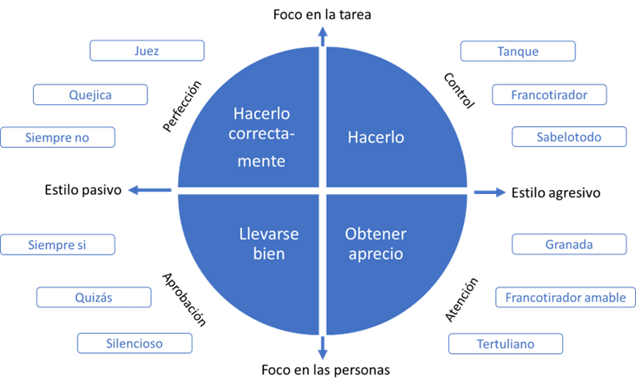

# Conversaciones que transforman equipos
:fontawesome-solid-user-pen: Autor: Enrique Sacanell

## Introducción

**Nos pasamos la vida en equipos.** En la escuela, en la Universidad, en el deporte, en el trabajo... Equipos operativos, equipos de proyecto, equipos directivos.

La capacidad de trabajar en equipo y de desarrollar equipos capaces de sacar el máximo potencial de sus miembros y de la interacción entre ellos se ha convertido en una competencia clave en la sociedad actual.

La complejidad reciente de los procesos de trabajo **exige una colaboración que supera incluso las barreras departamentales.** Todo ello hace del equipo un componente clave en cualquier organización actual y sus competencias para conservar algo crítico.

El enfoque tradicional de Recursos Humanos centrado en el individuo en sus metas de desempeño y necesidades ha quedado totalmente obsoleto por incompleto. La gestión de las personas y de su talento ha de incorporar al equipo como piedra angular.

### Las conversaciones de los equipos

**Nos pasamos la vida conversando.** Más aún no es imaginable un equipo sin conversaciones. El equipo conversa para coordinarse, para establecerse objetivos, para realizar un seguimiento, para analizar los problemas, para buscar soluciones, para innovar, etcétera. Sin embargo, es infrecuente que el equipo converse sobre cómo es su conversar. Cómo se dicen las cosas unas personas a otras, de qué se habla y de qué no se habla (y debería hablarse), qué papel tiene cada una de las personas en las conversaciones, ...

### El liderazgo como generador de conversaciones

**Liderar implica influir, influir en una determinada dirección.**

Es posible que como muchas otras personas consideres que el concepto de liderazgo no te afecta a ti. Sin embargo, **es imposible que no generes alguna influencia en tu entorno.** Puede que no sea de una forma intencional, pero lo ejerces no tengas duda. En ese sentido todos somos líderes y responsables de lo que ese liderazgo fomenta.

### 10 líneas de reflexión para empezar a analizar tu equipo y las conversaciones que realmente importan.

Hay 10 aspectos que pueden ayudar a encontrar qué tipo de conversaciones necesita tu equipo para reflexionar sobre estas cuestiones:

1.	Dimensión de la misión: ¿Tiene claro el equipo su propio sentido como equipo?, ¿para qué esta? En los equipos de proyecto puede ser más evidente la respuesta sin embargo cuando el equipo perdura en el tiempo o es un equipo de carácter estructural la respuesta no es tan obvia. Cuando el sentido del “para qué” no está claro el equipo se resiente pierde el rumbo y energía en su actividad.

**El “para qué” tiene una vertiente más pegada a la tarea** lo que viene a denominarse misión, y alude a la actividad que tiene que realizar el equipo. Al producto o servicio que se espera de él. Sin embargo, hay otro para qué más amplio. Es el propósito del equipo aquello más grande a lo que contribuye, lo identifica el equipo es compartido por todo el equipo.

2.	**Dimensión de evaluación:** ¿Cómo evalúa el equipo su avance en el logro de sus objetivos? Un equipo que no evalúa lo que hace pierde la capacidad de mejora de aprendizaje y de oportunidades de reconocimiento y celebración cuando es el caso. La falta de evaluación impide la retroalimentación del equipo y con ella la capacidad de desarrollar su potencial.

3.	**Dimensión de los encuentros:** ¿La forma en que se gestionan los encuentros del equipo es eficiente? En otras palabras, ¿cómo de bien se organizan y realizan las reuniones del equipo?, ¿son efectivas?, ¿se toman decisiones claras con responsables y plazos específicos? Cada vez hay más equipos que trabajan en la distancia añadiendo una dificultad a la gestión de las relaciones en el equipo.

4.	**Dimensión de comunicación:** ¿Cómo conversa el equipo?, ¿se hablan las cosas, aunque suponga contradecir lo que otra persona ha aportado o predomina lo políticamente correcto la imitación del conflicto? Cuando se opina de forma crítica ¿se hace de una manera que aporta y construye? ¿Hay temas de los que no se habla y se debería hablar? ¿Se habla desde la exposición y defensa de lo expuesto o desde la indagación y el deseo de entender los otros puntos de vista?

5.	**Dimensión emocional:** ¿Cómo se maneja las emociones en el equipo? ¿Hay espacio para poder hablar de ellas?, ¿nos preguntamos y preguntamos a las demás personas con qué ánimo se encuentra? ¿Cómo de competente somos manejando nuestras emociones, la sabemos identificar, sabemos cómo fluir de una emoción que nos hace daño a otra más constructiva?

6.	**Dimensión gestión de conflictos:** ¿El equipo gestione adecuadamente los conflictos? ¿Los callamos, los hablamos, cómo los hablamos?, ¿los vemos como una amenaza, como una oportunidad, y sabemos ponernos en el lugar del otro para entender su punto de vista?

7.	**Dimensión de la confianza:** ¿En qué medida hay confianza dentro del equipo? la confianza tiene diversas caras y cada una de ellas es clave para la fortaleza y eficacia de un equipo. 
a.	La confianza en la competencia técnica de mis compañeros “saben lo que hacen”.
b.	La confianza en que cuando alguien se compromete algo lo hace y si algo se lo impide se hace cargo rápidamente de la situación la comunica y buscamos la mejor forma de hacer frente a esta situación. 
c.	Confianza en que en caso de conflicto siempre se velará por el interés del equipo por encima de los intereses particulares. 
d.	La confianza en que las personas del equipo hablan claro y de frente y no van por la espalda u ocultan cosas para beneficio propio, aunque pueda resultar doloroso para otros. 
e.	Confianza en que en el equipo se puede decir lo que uno considera oportuno sin que se ha utilizado en su contra. Cómo está mi equipo en estas dimensiones.

8.	**Dimensión del liderazgo:** ¿Qué tipo de liderazgo hay en el equipo? ¿El liderazgo es evidente, está reconocido, tiene claro el equipo quien ejerce el liderazgo y lo que su equipo espera del o de ella? El líder ¿controla, confía de la responsabilidad y autonomía o la concentra en su persona da un feedback continuado y de calidad?

9.	**Dimensión del talento:** En qué medida se aprovecha el talento de cada persona del equipo. Conocemos que talentos les gustaría desarrollar más a cada componente del equipo.

10.	**Dimensión de la madurez:** ¿En qué momento el desarrollo se encuentra de equipo?

## Capítulo 1: Sobre los equipos

Con frecuencia surge la duda ¿somos un equipo? Igualmente, si somos un grupo de personas con una tarea común que para su realización necesita de la articulación de nuestro trabajo ya somos un equipo. Mejor o peor pero un equipo. Lo que tendríamos que preguntarnos no es qué tenemos que hacer para ser equipo sino qué tenemos que hacer para mejorar como equipo.

Si por el contrario somos un grupo de personas que colaboramos incluso compartimos lo que hacemos, pero no tenemos una tarea común propia y específica de este grupo entonces no somos un equipo y no necesitamos charlas. Lo que define la necesidad de ser o mejorar como equipo no es que 1 sea mejor que otro sino la existencia de una tarea compartida.

### Características de un equipo de alto rendimiento

No necesariamente todas estas características están presentes pero seguro que identificamos un buen número de las que planteo a continuación.

1.	Tienen un rendimiento excepcional mucho más allá de lo esperable por la suma de las capacidades de sus miembros.
2.	Todas las personas que lo componen muestran un compromiso intenso con el proyecto.
3.	Hoy crear un ambiente de trabajo positivo centrado tanto en el reconocimiento del esfuerzo como de los logros.
4.	Saben tomar decisiones que tengan la suficiente intensidad emocional como para producir la energía necesaria en el equipo.
5.	Muestra en altos niveles de confianza. Hola confianza de la habilidad técnica del equipo confianza lo que se dice se hace confianza en la sinceridad y el cuidado mutuo.
6.	Los acuerdos y compromisos se cumplen escrupulosamente.
7.	Hay un elevado grado de entusiasmo y energía.
8.	Hoy existe un relato compartido de la historia del equipo con momentos significativos vividos.
9.	Humor y diversión por encima de la media. 
10.	Aceptan los conflictos los gestionan constructivamente y promueven soluciones divergentes. 
11.	Saben decirse las cosas con claridad y respeto y escucharlas incluso cuando no son cómodas de decir ni de escuchar.
12.	Profundo compromiso con el crecimiento y el éxito personal mutuo.
13.	Compromiso personal con un propósito con algo mayor que ellos mismos.
14.	Hoy sinergia y conectividad entre ellos.
15.	Hoy aprenden y se desarrollan de manera individual y colectiva.

### El proyecto Aristóteles de Google

En 2012 Google inició un ambicioso proyecto para identificar cuáles eran las claves que hacían a algunos equipos extraordinarios. Partiendo de la hipótesis de que eran mejores equipos aquellos en los que sus componentes **compartían aficiones, se relacionaban fuera del trabajo, tenían expedientes académicos de gran nivel y estaban equilibrados en cuanto a género.**

Reunieron a un equipo de expertos multidisciplinar para realizar la investigación que no confirmó la hipótesis.
Hoy después de más de 200 entrevistas con empleados de Google y de analizar más de 250 atributos diferentes en unos 180 equipos de trabajo concluyeron identificando las 5 claves que llevan a un equipo hacia el alto rendimiento:

1.	Seguridad psicológica. Un equipo tiene más probabilidades de convertirse en extraordinario en la medida en que sus componentes sienten que pueden tomar riesgos sin que eso les exponga a ser cuestionados avergonzados o rechazados. Hoy sienten que pueden expresar sus opiniones libremente, aunque puedan incomodar o ir en contra de la opinión mayoritaria. Se sienten escuchados cuando exponen sus puntos de vista por disonantes o extraños que puedan parecer a otras personas.

2.	Confianza: los equipos que destacan muestran un alto grado de confianza entre sus miembros. Saben que pueden contar con el apoyo de sus compañeros y que todos ellos van a aportar lo mejor de sí mismos para obtener un trabajo de calidad en el plazo requerido.

3.	Estructura y claridad: los objetivos los planes y los roles están claros. Todos los conocéis lo entienden y los tienen como lo imitación en su día a día.

4.	El sentido del trabajo: saben que su trabajo contribuye a algo que les trasciende y que le importa a cada 1 de ellos.

5.	El impacto del trabajo: saben que lo que cada 1 hace tiene repercusión en lo que hace el resto del equipo. Ven con claridad el impacto de su trabajo también en su entorno y más allá del equipo.

### ¿Por qué fallan los equipos?

1.	**La cultura organizativa no fomenta el trabajo en equipo.** Desarrollar equipos de alto rendimiento no es solo una decisión que incumba a un equipo es algo que ha de potenciarse desde la máxima dirección con decisiones concretas que reconozcan fomenten y asienten las buenas prácticas del trabajo en equipo.

2.	**El sistema retributivo es contradictorio con el trabajo en equipo.** Modelos retributivos muy centrados en el individuo que incentivan la competencia interna pueden ser un elemento letal para el desarrollo de los equipos.

3.	**Un sistema de selección que no tiene en cuenta la capacidad para trabajar en equipo.** Se focaliza en la competencia técnica sin valorar suficientemente la trascendencia de que las personas tengan el potencial adecuado para contribuir al equipo.

4.	**Las relaciones de poder en la organización.** Algunas personas no aceptan que alguien con menor responsabilidad jerárquica o una titulación académica e inferior o incluso igual, pero desde otro ámbito de conocimiento opines sobre su trabajo o su desempeño. O contribuya en una relación de igual a igual a un trabajo de equipo.

5.	**La cultura de reconocimiento.** No existe una cultura de reconocimiento o esta no destaca el trabajo en equipo se produce un impacto negativo en el avance del propio equipo.

6.	**Hechos del pasado** que siguen impactando en el equipo (despidos marcha de algunos de sus miembros nombramientos etcétera cerrar paint y que han generado unas dinámicas sistémicas que afectan a su funcionamiento hoy punto el pasado puede ser un ancla para el crecimiento de un equipo.

7.	**Falta la claridad de los roles y en el desempeño de estos.**

8.	**El liderazgo no es adecuado** o la persona que lo dijera lo ejerce de manera poco eficiente.

9.	**El método para tomar decisiones** no es compartido o se toman malas decisiones.

10.	**Hay personas con agendas personales contradictorias** al desarrollo del equipo y al de sus objetivos. Alguna de las personas del equipo tiene la mirada fuera de él, están pendientes de otras cosas.

11.	**Hay relaciones personales conflictivas que afectan al equipo.** Las relaciones personales entre algunos de sus miembros son determinantes para el funcionamiento del equipo. No hace falta que las personas que componen equipo sean amigas, pero sí que sean capaces de relacionarse lo suficiente como para contribuir al equipo al máximo nivel. 

## Capítulo 2: Conversar en la diversidad del equipo

Conversar en equipo no es igual que conversar individualmente. **Cuando hablamos ante un grupo de personas se amplifica lo que decimos,** no solo por la multiplicación de interlocutores y con ello las interpretaciones y emociones, sino también por **la vivencia que supone experimentarlo en grupo.** Así una felicitación hecha en público adquiere una dimensión muy distinta a la fecha en privado.

Y qué decir de una crítica o del cuestionamiento de un comportamiento o de un resultado. Hacerlo en público supone un añadido emocional muy fuerte que llevará a la persona aludida a sentirse ridiculizada menospreciada o humillada.

Por ello las felicitaciones, los reconocimientos, los feedback de apoyo pueden plantearse en público, sin embargo, cualquier opinión crítica respecto al comportamiento trabajo una persona siempre ha de realizarse en privado.

En consecuencia, cualquier conversación que busque la modificación de una conducta comportamiento debemos realizarlo en un contexto de privacidad.

### Conversaciones en equipo que deberían ser individuales

Tenemos que **evitar utilizar al equipo como auditorio de conversaciones que afectan solo a una parte de las personas presentes en la reunión.** En un contexto grupal las cosas no se escuchan igual ni se expresan igual.

### Conversar en la diversidad

Es comúnmente valorado la riqueza de la diversidad en los equipos. Personas con formaciones académicas plurales, experiencias personales diversas, especializaciones diferentes, etcétera. **Todo ello enriquece al equipo sin embargo conlleva también estilos de comunicación y relación que pueden entrar en conflicto.**

Podemos identificar **cuatro estilos reflejados en la mayoría de los modelos.** Aunque cada persona es singular y una mezcla de componentes de cada estilo a veces algunos predominan.

•	Estilo racional centrado en el detalle y preocupado por el análisis que necesita tiempo para reflexionar. Tierra para el modelo bridge

•	Estilo racional pero orientado a la acción a las decisiones rápidas con los datos esenciales. Fuego.

•	Estilo emocionada apasionado creativo que huye de todo lo que le pueda ocurrir y da mucho peso a la intuición. Aire.

•	Estilo emocional, aunque me han preocupado por las personas por el con quién más que por el qué. Necesita sentirse incluido en que se cuenten con todas las personas. Agua.

En equipo **tenemos que modular nuestro estilo propio** para conectar al menos parcialmente con cada 1 de los otros estilos que nos escuchan.

En consecuencia, no tendremos que plantear las cosas ni con demasiada retórica ni con demasiados datos ni de forma demasiado directa ni demasiado desapasionada. En caso de no satisfacer a los presentes con nuestra comunicación es esencial que tengamos la capacidad de escuchar suficiente de lo verbal y sobre todo de lo no verbal para darnos cuenta de que no estamos conectando incluso que estamos generando una reacción adversa, para introducir el tema de la conversación y tratar de reconducirla: **“perdonad que pare un momento pero tengo la sensación de que hay algo en la presentación que algunas personas les estén acomodando y no quisiera continuar sin tratar de identificarlo para poder modificarlo.** Por ejemplo, tengo la sensación de que Pablo y María os estáis moviendo en la silla y poniendo cara de desagrado es así hay algo que desagrada de la presentación.

### Personas difíciles para conversar en equipo

3 tipos de comportamientos cuyo impulso motor es la perfección, es decir, que las cosas se hagan bien. En cuanto sienten o perciben el menor riesgo de que eso no sea así disparan ese lado oscuro de su estilo de relación.

•	El juez. Crítico frente al error quisquillosa hasta la perfección y asume que siempre tiene la razón. Le encanta juzgar a los demás y dictar sentencia condenándote.

•	El quejica. Disfruta haciéndose la víctima y se queja constantemente.

•	Él siempre no. Todo lo ve negro, aunque se ve a sí mismo como realista no como pesimista. Ninguna opción le parece buena.

Otros 3 tipos de comportamiento asociado con personas difíciles tienen como elemento motor el control el que las cosas se hagan.

•	El tanque. Avasallador y despistado, fuerte y contundente o silencioso y con una precisión quirúrgica. Para el tanque el fin justifica los medios. Si te interpones en su camino te elimina.

•	El francotirador. Se dedica a encontrar tus puntos flacos y a utilizarlos en tu contra saboteándote, ofendiéndote o hablando mal de ti.

•	El sabelotodo te explicará sus conocimientos porque realmente sabe mucho pero no dedicarle ni 1 minuto a escuchar tus ideas claramente equivocadas y mucho más pobres que las suyas.

En otras ocasiones el motor de comportamiento es **obtener atención y sentir aprecio.**

1.	El Granada. Explota con arrebatos desproporcionados respecto a las circunstancias de donante y logra que los demás se alejen buscando refugio sin entender nada.

2.	El francotirador amable. Sus ataques son una forma divertida de llamar la atención.

3.	El tertuliano. Habla de todo sin tener conocimiento de nada.

En los últimos 3 tipos de comportamiento que pueden resultar difíciles en una conversación en equipo el motor que los impulsa es el de llevarse bien sentirse aprobados.

•	Él siempre sí. Se ofrece rápidamente a todo, aunque luego le cuesta cumplir sus promesas. Quiere complacer a todo el mundo, pero en realidad no complace a nadie.

•	El quizás, quizás, quizás. Cuando se enfrentan una decisión importante postergan la decisión eternamente. Les cuesta mucho trabajo posicionarse.

•	El silencioso. Es imposible saber que le pasan y que piensas porque no dice nada.

{ align=left }

## Capítulo 3: Conversaciones básicas en las reuniones de equipo

**Tener claridad sobre el fin para el que se presenta el tema** es determinante para seleccionar la mejor forma de estructurar la conversación. De ahí la importancia que tiene anticipar a las personas participantes, no solo los temas a tratar, sino la finalidad con la que se presenta al equipo.

Si las agrupamos según el objetivo o la finalidad con la que se lleva un tema de la reunión podemos identificar cuatro tipos básicos de conversaciones: 

•	**Seguimiento:** centrada en el seguimiento de los acuerdos adoptados o los plazos establecidos para el desarrollo de un proyecto.

•	**Información:** orientada a transmitir hechos acontecimientos o acuerdos adoptados en otros foros.

•	**Decisión:** dirigida a tomar un acuerdo en torno a un tema.

•	**Debate:** en la que no se pretende cerrar un tema sino compartir opiniones reflexiones o puntos de vista.

Una función clave de quien lidera una reunión de equipo es mantenerla centrada en su ámbito de responsabilidad, enfocada en los temas previstos y en el objetivo con el que cada 1 se ha planteado.

## Capítulo 4: Conversaciones de expectativas y feedback
Hoy vivimos saturados de reuniones. **No se trata de añadir más reuniones** o de reunirse por obligación. Cuantas menos reuniones mejor pero no menos que las que son imprescindibles. La frecuencia puede variar en diversos momentos del año o en diferentes momentos del equipo o de la tarea que tenga entre manos. Sin embargo, tener una reunión del equipo al mes podemos considerarlo como un mínimo razonable.

### Cómo manejar las reuniones de equipo

### Conversaciones para fijar expectativas

Al igual que cualquier persona, **un equipo necesita saber qué se espera de él.** La falta de claridad en este aspecto desoriente puede provocar que se avance en una dirección en una forma que no se corresponde con esas expectativas.

**Quien lidera al equipo tiene la responsabilidad de generar este tipo de conversaciones en el equipo.** Quien forma parte de él tiene la responsabilidad de plantear la falta de claridad respecto a lo que se espera, cuando así lo percibe.

Cuando las expectativas no están suficientemente definidas surgen con facilidad discrepancias y conflictos en el equipo ya que cada persona saca sus conclusiones sobre lo que ha de hacerse, cuáles son las prioridades y la forma en que ha de hacerse.

Las expectativas respecto a un equipo no se refieren solo a objetivos, a lo que tiene que hacer o lograr, sino también a la forma en que el equipo ha de trabajar, a los valores que se espera que su forma de hacer ponga de manifiesto, a la manera de relacionarse o colaborar en el propio equipo y con otros equipos, con proveedores o con clientes etcétera.

Las expectativas pueden surgir: 

•	Desde otros niveles de la organización. 
•	Desde que lidera el equipo. 
•	Desde el propio equipo.

**Las expectativas que la organización define son un marco en el que trabajar y no le corresponde al equipo discutirlas** al menos una vez que han sido aprobadas en el órgano legitimado para aprobarlas punta el equipo de conocerlas y éstas han de expresarse con el detalle la especificidad suficiente como para que puedan orientar las conductas del trabajo a desarrollar. A partir de ahí el equipo podrá plantearse qué ha de hacer para satisfacer adecuadamente esas expectativas ya que la organización juzgará su desempeño por el grado en que se satisfagan.

Al comienzo de cada año es útil que el equipo mantenga una conversación sobre las expectativas para este nuevo periodo. Una conversación que comienza con las expectativas que la organización ha definido, continúa explorando las del propio equipo líder incluido y termina incorporando aquellas otras que su líder pueda plantear.

### Esquema básico de una conversación de fijación de expectativas

### Feedback características generales y tipos

Una conversación de feedback es aquella en la que **damos nuestra valoración sobre una conducta o un desempeño.** Ha de tener lugar **lo más cerca posible del momento en que se ha producido el hecho a valorar.** Asimismo, en ella tenemos que mencionar la situación específica, el comportamiento o el resultado sobre el que vamos a expresar nuestra opinión.

**Los equipos como las personas necesitan recibir feedback para saber si se mueve en la dirección que se espera de ellos.** En este sentido el feedback es en sí mismo una forma de reconocimiento, una manera de hacer que el equipo se sienta visto.

Claro que también es importante un buen equilibrio entre **feedback de apoyo** (el que damos para subrayar que se trabaja según lo esperado o más allá y apoyar la repetición de ese comportamiento) y el **feedback de reorientación** (con el que tratamos de mostrar que algo ha de tomar otro camino porque tiene que hacerse de otra manera).

En el caso del feedback el equilibrio más productivo no es 1:1, 1 de apoyo, 1 de reorientación. Hemos de dar más peso y más frecuencia el apoyo a las cosas bien hechas que sin duda serán las más frecuentes.

El feedback de apoyo podemos darlo al equipo o a una persona concreta en una reunión del equipo. Sin embargo, **el feedback de reorientación solo lo haremos en equipo cuando sea el su destinatario.** El feedback de reorientación individual siempre tenemos que realizarlo en privado. Hacerlo en público tiene un impacto emocional grande que va a incrementar la respuesta defensiva y a dañar la relación con esa persona.

### Conversación de feedback de apoyo

¿Cuántas veces en el último mes le has dicho a tu equipo o a cualquier equipo de los que formas parte una frase de reconocimiento agradecimiento felicitación etcétera por el trabajo realizado?

El feedback de apoyo de apoyo, el reconocimiento al esfuerzo, al trabajo realizado a los resultados logrados **es una energía inagotable** que renueva las fuerzas del equipo aumenta su autoestima la confianza en su capacidad y el orgullo de formar parte de él etc.

Tenemos que aprender a desarrollar en nosotros y nuestros equipos la capacidad de tomar **conciencia de los “micro éxitos”,** de decirnos lo que se ha hecho bien subrayar aquello que ha sido un buen ejemplo de nuestros valores etcétera culturalmente tendremos a buscar acciones o hechos espectaculares para identificar motivos de apoyo o reconocimiento.

Si es el caso podemos añadir una mención a la contribución específica de cada miembro del equipo. **Si queremos subrayar solo la aportación de alguna persona o de parte del equipo es importante contextualizarlo para no dar un mensaje equívoco.** “En esto todo el equipo hemos sido copartícipes sin embargo en esta ocasión me gustaría agradecer de manera especial a Julia que a pesar de estar pasando por unas circunstancias personales difíciles ha estado como 1 más afrontando el problema”.

Dar feedback de apoyo a una persona o a una parte del equipo **implica hacer explícitas las razones de esa diferencia** y asegurarnos de que en otras ocasiones sean otras las personas mencionadas.

Cuando somos nosotros los que recibimos tenemos que evitar respuestas evasivas. “No es nada”, y “es nuestro trabajo”, o “cualquiera hubiera hecho lo mismo”. **No deja de ser una forma de quitar valor a los menos dicen y con ello a quién lo dice.**

**Un feedback de apoyo no es un discurso motivador o una arenga.** En este caso se expresan valoraciones positivas pero inespecíficas. “Estoy encantado de trabajar con vosotros sois un gran equipo y todo El Mundo lo valora sigamos así y seremos un equipo extraordinario.”

A nadie les agrada esas palabras **sin embargo no concretan la conducta o los hechos que despiertan tanto entusiasmo.** Un feedback de apoyo tiene por finalidad que una conducta acción se repita por lo que es esencial que quede claro el motivo concreto que lo genera. Incluso es útil que tras el mensaje inicial preguntemos si queda claro el motivo concreto que genera ese reconocimiento.

### Conversación de feedback de reorientación

Hemos explicado anteriormente que el feedback de reorientación busca que una conducta comportamiento se modifique, por ejemplo, hacer algo que no se ha hecho, hacerlo más, hacerlo menos hacerlo diferente o no hacerlo.

Es importante insistir en que cuando se refiere a una persona a una parte del equipo lo recomendable es dar el feedback a la persona con personas afectadas no delante del equipo.

**Abordar una conversación de reorientación requiere de una disposición emocional** adecuada cuenta llegamos con una intensidad alta es más fácil que perdamos las riendas de la conversación y digamos hagamos algo que no ayude al objetivo que nos planteamos con ella.

Además de nuestra emocionalidad también tendremos que preparar otros aspectos que necesitaremos durante la conversación:

•	¿Qué conducta comportamiento concreto específico y observable quiero plantear al equipo que es necesario modificar?

•	¿Cuál es el fin último al que quiero que contribuya esta conversación? no lo que quiero que el equipo cambie o haga diferente sino, aquello a lo que contribuiría a ese cambio.

•	¿Cómo puedo enunciar de una manera neutra el tema sobre el que quiero centrar la conversación sin anticipar mi punto de vista? Por ejemplo, en lugar de decir “quiero que hablemos sobre el retraso injustificable del pedido que teníamos”, un enunciado neutro sería “quiero que hablemos sobre los plazos de entrega del pedido que teníamos”. El enunciado neutro nos va a permitir continuar la conversación con una pregunta abierta por ejemplo me gustaría escucharos para entender lo que ha ocurrido.

•	También es necesario que preparemos evidencias de lo ocurrido y de sus consecuencias reales o potenciales para aportarlo en el debate

Un aspecto para tener en cuenta el comienzo de este tipo de conversaciones **la posibilidad de mostrar vulnerabilidad por parte de quien la lidera.** Expresiones del tipo “quiero plantear un tema que me genera inquietud”, “no es algo de lo que hablamos habitualmente y no estoy seguro de hacerlo adecuadamente”, “quiero pedir disculpas por no haber planteado antes este asunto” etc. Nos muestra como seres humanos imperfectos y ayudan a generar un clima de conexión con el equipo que reduzca la tendencia a ponernos en una posición defensiva

## Capítulo 5: Límites peticiones y malas noticias

### Conversaciones de límites

Una vez fijadas las expectativas, el equipo en su trabajo cotidiano va mostrando en qué medida las va a cumplir puede que surja alguna circunstancia no planteada a las expectativas definidas en la que el equipo no responde adecuadamente ya sea en criterio de su líder de la organización o del propio equipo. En este caso será necesaria una nueva conversación que establezca el criterio o los criterios a utilizar en situaciones equivalentes. En otras palabras, una conversación que deje claras las expectativas incluyendo la nueva situación.

La conversación de límites tiene por objetivo **hacer ver al equipo que se ha llegado a una situación extrema,** que cuestiona bases esenciales del funcionamiento del equipo y que han de adoptarse medidas para que no vuelva a repetirse.

**Es una conversación en la que el tono y el lenguaje corporal son especialmente importantes** para transmitir el carácter de gravedad que supone llegar a ese punto. Sin embargo, **no es, ni puede ser una reprimenda, un reproche o una amenaza.** Es una conversación sobre un incumplimiento reiterado que necesita ser analizado desde otro lugar ya que la reorientación no parece ser suficiente. ¿Qué es lo que ocurre que acordamos algo y no lo cumplimos, incluso después de plantearnos el incumplimiento en dos conversaciones diferentes?
		
