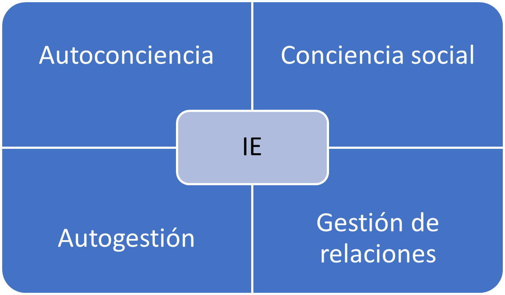

# Liderazgo. El poder de la inteligencia emocional

:fontawesome-solid-user-pen: Autor: Daniel Goleman

## Una sinergia sorprendente

Como propuse en el libro La inteligencia emocional en la empresa, las capacidades de la inteligencia emocional (más que el cociente intelectual o las habilidades técnicas HP) se presentan como la competencia determinante que mejor predice que individuo de un grupo de personas muy inteligentes será mejor líder.

En los niveles superiores, los modelos de competencia para el liderazgo suelen estar compuestos entre el 80 y el cien por cien por capacidades basadas en la inteligencia emocional.

En una economía impulsada por el llamado trabajo del conocimiento, el valor se crea con el esfuerzo de un equipo, lo que nos lleva a fijarnos en el coeficiente intelectual colectivo, concepto desarrollado por Robert Sternberg y Wendy Williams en Yale que representa la suma total de las mejores aptitudes de todos los miembros del equipo en su máxima capacidad. Sin embargo, lo que determina la productividad real del colectivo no es su potencial teórico es decir su coeficiente intelectual colectivo, sino la forma hora de coordinar sus esfuerzos. En otras palabras, la armonía interpersonal.

## El marco de competencias

Dominar una competencia emocional como la Atención al Cliente o el trabajo en equipo requiere un dominio subyacente de principios básicos de la inteligencia emocional como la conciencia social y la gestión de las relaciones. 

{ align=left }

Sin embargo, las competencias emocionales se adquieren: no basta con tener conciencia social o facilidad de gestión de las relaciones para garantizar que una persona supere el aprendizaje adicional necesario para tratar adecuadamente a un cliente o para resolver un conflicto. Sencillamente cuenta con el potencial de dominar sus competencias.

Y por consiguiente una capacidad de inteligencia emocional subyacente es necesaria coma y aunque no suficiente, para manifestar una determinada competencia o habilidad laboral.

## Mandar con corazón

Un bajo nivel de inteligencia emocional en el trabajo tiene un coste inevitable en los resultados económicos. La rentabilidad de la inteligencia emocional es una idea relativamente nueva en la empresa y puede que a algunos directivos les cueste aceptarla.

En un estudio realizado entre 250 ejecutivos se comprobó que en su mayoría tenían la impresión de que el trabajo exigía la implicación de la cabeza no del corazón. Muchos afirmaban que les daba miedo que sentir empatía o compasión por sus compañeros de trabajo les supusiera un conflicto con sus objetivos laborales. Una en concreto aseguró que la idea de prestar atención a los sentimientos de sus subordinados era absurda ya que en su opinión provocaría que fuera imposible manejar a la gente. Otros argumentaron que si no marcarán las distancias desde un punto de vista emocional no podrían tomar las decisiones difíciles que requiere una empresa, aunque lo más probable es que en realidad comunicara en esas decisiones de forma más afable.

El liderazgo no es sinónimo de dominación sino el arte de convencer a la gente de que colabore para alcanzar un objetivo común. Además, centrándonos en la gestión de nuestra trayectoria personal puede que no haya nada más fundamental que reconocer una profunda conexión emocional con nuestro cometido y saber qué cambios podrían provocarnos una mayor satisfacción laboral.

## El arte de la crítica

En cierto sentido la crítica es una de las tareas más importantes de un directivo, pero en la realidad también es una de las más temidas y más aplazadas. Además, como en el caso del vicepresidente sarcástico, son muchos los jefes que no demuestran mucha destreza en el arte decisivo de la comunicación de las reacciones. Esa de alguna tiene graves consecuencias: del mismo modo que la salud emocional de una pareja depende de lo bien que sepan expresar las quejas que vayan surgiendo, la eficiencia, el bienestar y la productividad de los trabajadores dependen de cómo se les informe de los problemas que aparezcan. De hecho, la expresión y la recepción de las críticas determinan en gran medida la satisfacción del individuo con su trabajo con sus compañeros y con sus superiores.

## La peor forma de motivar a alguien

Las críticas se expresan como ataques personales y no como quejas que puedan dar lugar a un cambio; se trata de acusaciones dirigidas a alguien en concreto con buena dosis de indignación sarcasmo y desdén y en ambos casos dan lugar a reacciones defensivas coma a una declinación de la responsabilidad y en última instancia a las evasivas o la resistencia pasiva cargada de rencor que provoca el sentirse tratado injustamente.

Así en un estudio realizado entre 108 directivos y administrativas las críticas mal planteadas aparecieron en la lista de motivos de conflicto en el trabajo y por delante de la desconfianza, los choques de personalidades y las luchas de poder. Un estudio llevado a cabo en el Instituto Politécnico Rensselear muestra devastadoras que ponen las críticas siguientes en las relaciones laborales.

Muchos jefes critican con gran facilidad, pero escatiman los elogios con lo que sus subordinados se quedan con la impresión de que solo les dicen algo sobre su trabajo cuando lo hacen mal. Esta tendencia a la crítica se agrava cuando los directivos retrasan durante largos periodos cualquier tipo de comentario. 

La mayoría de las veces los problemas de rendimiento de un trabajador no son repentinos, sino que van apareciendo progresivamente, afirma JR Larsson, psicólogo de la Universidad de Illinois en Urbana, cuando el jefe no dice lo que piensa con rapidez su frustración va aumentando poco a poco hasta que un día estalla. Si hubiera expresado la crítica antes el trabajador podría haber corregido el problema. Con demasiada frecuencia el individuo lanza críticas solo cuando las cosas se salen de madre, cuando está tan enfadado que no puede contenerse.

## La crítica con mano izquierda

Una crítica planteada con mano izquierda se centra en lo que ha hecho el individuo y en lo que puede hacer en lugar de atribuir una mala actuación a un rasgo de su personalidad.

Además, si pensamos en la motivación vemos que cuando alguien cree que sus errores se deben a una carencia de su carácter que no puede corregir pierde la esperanza y deja de esforzarse.

La persona se desmoraliza si dicen que está haciendo algo mal sin que le den detalles que permitan mejorar.

## ¿Qué hay que tener para ser líder?

Las distintas situaciones también requieren distintos tipos de liderazgo. En las fusiones solo hace falta un negociador sensible que lleve el timón mientras que para dar un golpe de timón lo habitual es que se requiera una autoridad más contundente. No obstante, la experiencia me ha enseñado que los líderes más eficientes coinciden en un aspecto fundamental: todos poseen un gran nivel de lo que ha dado en llamarse inteligencia emocional.

Para describir la inteligencia emocional en la empresa analicé los modelos de competencia de 188 empresas en su mayoría grandes e internacionales y de organismos públicos. Agrupe las capacidades en 3 categorías: las habilidades puramente técnicas como la contabilidad y la confección de planes comerciales; las capacidades cognitivas como el razonamiento analítico y las competencias que eran reflejo de la inteligencia emocional como la capacidad de trabajar en equipo y la eficiencia al dirigir un proceso de cambio.

### La autoconciencia

la autoconciencia es el primer componente de la inteligencia emocional algo lógico si tenemos en cuenta que hace miles de años el oráculo de Delfos ya aconsejaba: conócete a ti mismo. La autoconciencia implica comprender en profundidad las emociones, los puntos fuertes, las debilidades, las necesidades y los impulsos de 1 mismo.

El individuo que posee un alto grado de autoconciencia reconoce cómo afectan sus sentimientos a él mismo a los demás y a su rendimiento laboral. Así una persona autoconsciente que sabe que cuando tiene que correr para entregar un trabajo suelen salir las cosas mal se organiza cuidadosamente y termina con mucha antelación en lo que tiene que hacer.

La autoconciencia abarca la concepción que tiene una persona de sus valores y sus objetivos. Una persona muy autoconsciente sabe dónde se dirige y por qué; así por ejemplo se mostrará firme al rechazar una oferta laboral que resulte tentadora desde un punto de vista económico, pero no encaje con sus principios u objetivos a largo plazo. Las decisiones de las gente autoconsciente concuerdan con sus valores en consecuencia a menudo el trabajo les resulta estimulante.

Por ejemplo, una directiva que conozco se mostró escéptica ante un nuevo servicio de asistentes personales de compras que iban a introducir en su empresa una importante cadena de grandes almacenes. Sin que su equipo sus jefes se lo pidieran les dio una explicación: “me cuesta respaldar el lanzamiento de este servicio confesó, porque me apetecía mucho dirigirlo y no me eligieron. Dadme tiempo para que me lo trabaje.”

Una de las características principales de la autoconciencia es un sentido del humor autocrítico.

**La gente autoconsciente está al tanto de sus limitaciones y sus puntos fuertes,** y se siente cómodo hablando de ellos y con frecuencia demuestra afán de recibir críticas constructivas. Además, saben cuándo pedir ayuda.

### La autogestión o autorregulación

La autorregulación, una especie de conversación interior continuada, es el componente de la inteligencia emocional que nos libera de la prisión en la que pueden encerrarnos en nuestros propios sentimientos. Las personas que entablan este tipo de conversación tienen momentos de mal humor e impulsos emocionales como todo el mundo, pero encuentran formas de controlarlos e incluso de que analizarlos de forma útil.

Imaginémonos a un Ejecutivo que acaba de ver a un equipo de trabajadores a sus órdenes presentar un análisis chapucero al Consejo de administración de la empresa. En el ambiente de pesimismo que impera a continuación puede que tenga tentación de dar un golpe en la mesa presa de la ira o de pegar una patada a una silla. Podría levantarse de repente y hoy ponerse a chillar al grupo. O mantener un silencio adusto y mirar fijamente a todo El Mundo antes de marcharse dando un portazo. Sin embargo, se tiene facilidad para la autorregulación elegirá otra salida.

¿Por qué es tan importante la autorregulación para los líderes? **Los líderes que controlan sus sentimientos y sus impulsos pueden crear un entorno de confianza e imparcialidad** reduciendo drásticamente las peleas internas y elevando la productividad.

En segundo lugar, la autorregulación es importante por motivos de competitividad. **Las personas que dominan sus emociones pueden avanzar con los cambios.**

En tercer lugar, la autorregulación en liderazgo fomenta la integridad que no es solo una virtud personal sino también un punto fuerte en el campo organizativo. Muchos de los errores que se cometen en las empresas son consecuencia de una conducta impulsiva.

Los indicadores de la autorregulación emocional son por consiguiente fáciles de ver: tendencia a reflexionar y a meditar, comodidad con la ambigüedad y el cambio, y también integridad es decir capacidad de reprimir deseos impulsivos.

Si existe un rasgo que poseen prácticamente todos los líderes válidos es la motivación, una variante de hoy la autogestión que consiste en movilizar las emociones positivas para hacernos avanzar hacia nuestros objetivos.

Si buscamos líderes **¿cómo podemos identificar a la gente motivada por el impulso de obtener resultados y no por las recompensas externas? El primer indicio es la pasión por el trabajo en sí: este tipo de gente busca retos creativos siente pasión por aprender y se enorgullece mucho del trabajo bien hecho.**

Con frecuencia quienes la poseen parecen impacientarse con el statu quo y se muestran insistentes al preguntar por qué se hacen las cosas de una forma y no de otra; están en ansiosos por explorar nuevas formas de trabajar. Emoción de curiosidad.

## La empatía
De todas las dimensiones de la inteligencia emocional, la empatía es la que se reconoce con mayor facilidad.

La palabra en sí ya parece poco profesional, como si desentonara entre las duras realidades del mercado punta No obstante la empatía no equivale a la sensiblería: en el caso de un líder no supone adoptar las emociones de los demás como propias y tratar de complacer a todo el mundo, lo que sería una pesadilla e impediría actuar. Por el contrario, la empatía implica considerar detenidamente los sentimientos de los subordinados junto con otros factores en el proceso de toma de decisiones inteligentes.

La globalización es otro motivo del aumento de la importancia de la empatía entre los líderes empresariales. El diálogo intercultural puede provocar con facilidad confusiones y malentendidos. Un antídoto es la empatía. La gente que hace gala de ella está en sintonía con las sutilezas del lenguaje corporal, recibe el mensaje que se esconde entre líneas.

Por último, la empatía desempeña una función decisiva para retener a los trabajadores válidos en especial en la economía de la información de nuestros días.

## La capacidad social

Los dos primeros componentes de la inteligencia emocional son habilidad de autogestión. Los dos últimos la empatía y la capacidad social tienen que ver con la Facultad de gestionar las relaciones con los demás.

Los individuos con capacidad social suelen tener un amplio círculo de conocidos y facilidad para encontrar puntos en común con gente de todo tipo es decir para lograr una compenetración.

Podríamos decir que la capacidad social es la culminación de las demás dimensiones de la inteligencia emocional.

# Liderazgo que consigue resultados
Si preguntamos a un grupo cualquiera de profesionales del mundo de la empresa que hacen los líderes eficientes las respuestas serán de lo más variado. Los líderes marcan las estrategias motivan crean una misión implantan una cultura pero es probable que haya una única respuesta: el principal trabajo del líder es conseguir resultados.

Una investigación de la consultora Jaime Albert basada en una muestra aleatoria de 3871 individuos seleccionados de una base de datos de más de 20000 ejecutivos en todo El Mundo acaba con gran parte del misterio que envolvía el liderazgo eficaz. El estudio descubre 6 estilos de liderazgo distintos cada 1 de ellos derivados de diferentes componentes de la inteligencia emocional.

Los líderes autoritarios movilizan a la gente hacia una visión punta los líderes conciliadores generan vínculos emocionales y armonía. Los líderes democráticos crean consenso mediante la participación. Los líderes ejemplarizantes esperan rendimiento y autonomía. Los líderes coach contribuyen al desarrollo de la gente para el futuro punta y los líderes coercitivos exigen una sumisión inmediata.

## La medición de los efectos del liderazgo
## El estilo autoritario
## El estilo coach
## El estilo conciliador
## El estilo democrático
## El estilo ejemplarizante
## El estilo progresivo
## Los líderes necesitan muchos estilos
## Ampliar el repertorio
# El coeficiente intelectual colectivo
La economía actual depende en gran medida de los llamados trabajadores del conocimiento, personas cuya productividad se centra en el aumento del valor de la información, ya sea como analistas de mercado escritores o programadores informáticos. Peter Drucker que acuñó el término trabajador del conocimiento señala que se trata de individuos muy especializados cuya productividad depende de que su labor esté coordinada dentro de un equipo organizativo.

Aunque la gente colabora desde siempre aseguró Drucker en el caso de los trabajadores del conocimiento la unidad de trabajo ya no es el individuo sino el equipo.

Por ese motivo la inteligencia emocional es decir las habilidades que ayuden a la gente a funcionar en armonía se valoran cada vez más en el entorno laboral contemporáneo.

Cuando la gente se reúne para colaborar sea en una reunión de planificación ejecutiva o en un equipo que trabaja para crear un producto surge un coeficiente de intelectual colectivo es decir la suma total del talento y la capacidad de todos los participantes. El nivel de ese cociente intelectual es el que determina lo bien que cumplen su cometido. Resulta que el elemento más importante de la inteligencia colectiva no es el promedio de coeficientes intelectuales en el sentido académico sino más bien la inteligencia emocional. La clave para alcanzar un alto coeficiente intelectual colectivo es la armonía social. Es esa capacidad de armonización la que provoca que a pesar de coincidir todos los demás factores un grupo destaque en habilidad productividad y éxito mientras otros con miembros igual de competentes y capaces en otro sentido se obtienen peores resultados.

Sternberg y Williams descubrieron que quienes tenían demasiadas ganas de participar en un equipo fueron un lastre para el grupo y redujeron su rendimiento general. Estos individuos tan entusiastas eran excesivamente controladores y dominantes y al parecer carecían de un elemento básico de la inteligencia social como la capacidad de reconocer lo que es adecuado y lo que no en un tira y afloja. Otro punto negativo fueron los pesos muertos los individuos que no participaban.

Cuando en un equipo existen muchas interferencias emocionales y sociales sea por miedo ira rivalidades o resentimientos la gente no puede dar lo mejor de sí sin embargo la armonía permite a un grupo aprovechar al máximo las capacidades de sus miembros más creativos y competentes.

Las redes informales son especialmente decisivas para resolver problemas imprevistos. La organización formal está concebida para afrontar problemas que pueden preverse con facilidad afirma un estudio de estas redes, pero cuando surgen obstáculos inesperados la que entra en juegos es la de informal. Su complejo entramado de vínculos sociales va formándose cada vez que se comunican los colegas y se solidifica con el tiempo para dar lugar a redes sorprendentemente estables. Las redes informales y sumamente flexibles funcionan diagonal y elípticamente y se saltan escalones del organigrama para conseguir resultados.

Un análisis más en profundidad de las redes informales muestra que existen como mínimo 3 variedades: las de comunicación quién habla con quién, las de pericia y las de confianza.

Las estrellas de una organización son con frecuencia quienes mantienen fuertes conexiones en todas las redes sean de comunicación de pericia o de confianza.

# El liderazgo esencial página 91
